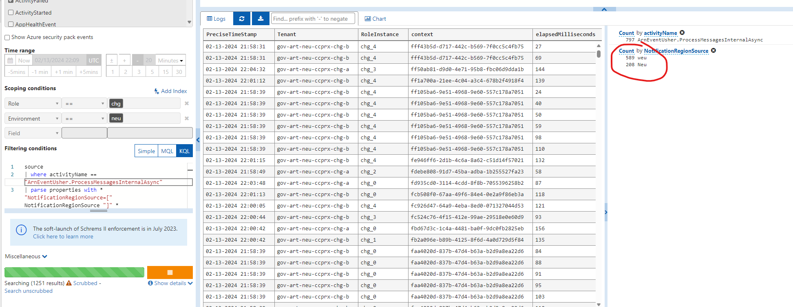

# BCDR : Modern Scale Unit
Modern Scale Unit is introduced to align with north-star architecture to consume *from* and publish *to* ARN (ARN->CC->ARN). Currently being used to onboard any new proxy type(s) with the eventual goal to migrate all the datasets (tracked, container, geneva health) from ARG SU (in separate modern SUs).  
**NOTE**: For any BCDR in general, please involve the Incident manager, respective team oncall (ARB in this case) and if needed, component team as well (change compute here)

## Description:
This TSG higlights the actions to take for modern scale units of the ChangeCompute service when issues start occuring in a region (This is **NOT** for Change Compute in the Tracked/ARG Scale Unit).
Applicable when (any of) the following issues occur in the region (**except** for issues with Azure Storage Accounts, which require different approach for [BCDR](./StorageAccountsBCDR.md)):
   - Change Compute Service 
   - Event Hub
   - Network

we use this TSG to trigger BCDR.
BCDR actions described here cover a broad range of issues (3) for simplicity.
If the issue is still not mitigated, please reach out to the Change Compute team.

## Background: 
Change Compute modern SU exists in 4 PROD regions: East US, West US2, West Europe, and North Europe. It uses a paired region setup, where

| Region with Issue         | Region to failover traffic to     | 
|---------------------------|-----------------------------------|
| East US                   | West US2                          | 
| West US2                  | East US                           |
| West Europe               | North Europe                      |
| North Europe              | West Europe                       |

So if Change Compute Proxy in East US has an issue, we will fail its traffic over to Change Compute Proxy in West US2. 

## Information gathering:
1. Find WHEN (UTC) was the last message processed in the broken region (refer Pre-Validation steps below). If unclear, find WHEN in UTC the issue started occuring.

## Pre-Validation steps:

- Use this [dashboard](https://portal.microsoftgeneva.com/s/CE509C30?overrides=[{"query":"//dataSources","key":"account","replacement":"AzureResourcesTopology"},{"query":"//*[id='Environment']","key":"value","replacement":""},{"query":"//*[id='ScaleUnit']","key":"value","replacement":"Proxy"}]%20) and ICM ticket to get the starting time of the issue.

- If still unclear, use [this](https://portal.microsoftgeneva.com/s/A0E71CA3) jarvis query to find the last UTC time when a notification was successfully processed (change the `Environment` to the correct region that is facing issues).

Approximate timestamp values (within 5-10 mins of incident) should be sufficient.

## Actions:
 - Using the starting time of the issue, trigger the following command for backup region:
[ACIS ACTION](https://portal.microsoftgeneva.com/563F004C?genevatraceguid=8d85d41a-34b2-4af3-a42b-5f274fe0fedf) and change the time in the `value` section to the UTC time to around ~5 minutes before the issue started. For example, if the issue started on `02/13/2024 9:20:00 PM +00:00`, then set the `value` to `02/13/2024 9:15:00 PM +00:00`
      - Action Name: `Azure Resource Graph > Common > ArgAdminConfig_UpdateConfig`
      - Endpoint: `{backup_region}_tm_ChangeComputeProxy`
      - appName: `ResourcesChangeComputeServiceHost`
      - serviceName: `ResourcesChangeComputeService`
      - section: `EventUsher`
      - key: `StartBCDRAt`
      - value: `02/13/2024 9:15:00 PM +00:00` (Replace this value with actual time)

- Scale out the backup region VMSS

## Post validation steps:
- Check the [logs](https://portal.microsoftgeneva.com/s/980FFB31) and ensure that the backup region is processing messages from its own region and the failed region:

- From the Azure portal, verify incoming messages are being read from the backup event hub, i.e. the metrics Incoming/Outgoing messages get aligned.
  (Backup event hub namespace follows this naming pattern: gov-rp-art-cc-eventhub-{BackupEnvironmentNameLowerCase}-{ScaleUnitShortNameLowerCase}-2)
- Also, verify dashboards for any unexpected anomalies, like increased failures, high CPU etc.

## Post recovery steps
 - When the issue is mitigated and the affected region goes back to healthy state, the only thing left will be to reset the configuration.
[ACIS ACTION](https://portal.microsoftgeneva.com/924C0519?genevatraceguid=8d85d41a-34b2-4af3-a42b-5f274fe0fedf)
    
    - Action Name: `Azure Resource Graph > Common > ArgAdminConfig_ResetConfig`
    - Endpoint: `{region}_tm_ChangeComputeProxy`
    - appName: `ResourcesChangeComputeServiceHost`
    - serviceName: `ResourcesChangeComputeService`
    - section: `EventUsher`
    - key: `StartBCDRAt`

## Knowledge:
1. Messages are duplicated in a second eventhub, we can trigger reading these messages, starting from the identified error time, from this backup event hub.
2. The backup eventhub is only in the paired region, so the BCDR process needs to trigger the ACIS action of reading messages in the backup region.