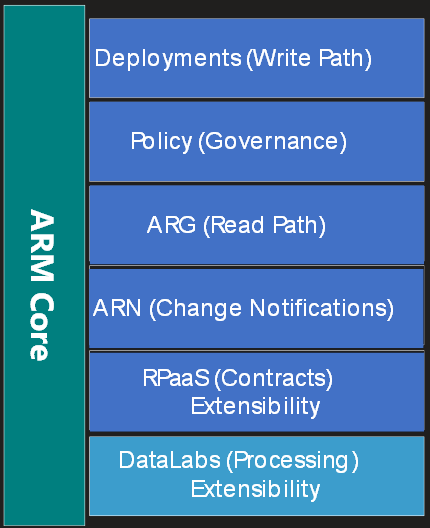
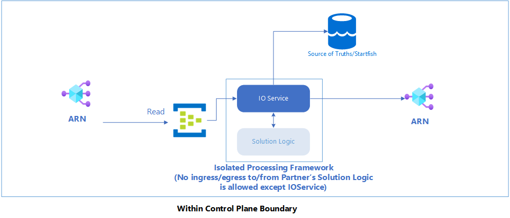
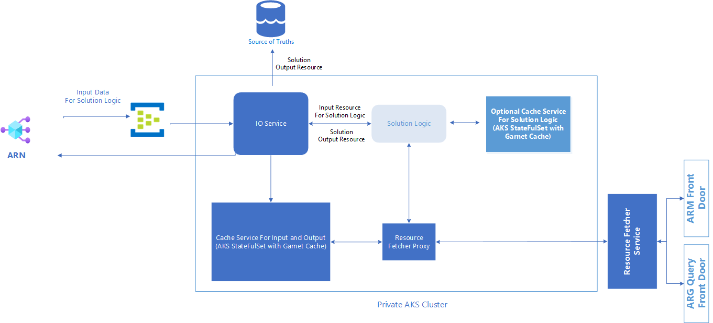
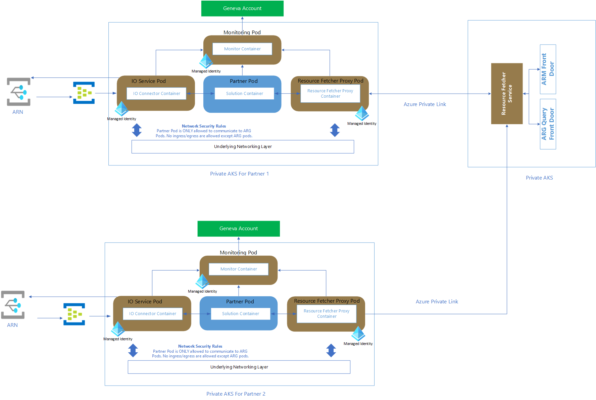
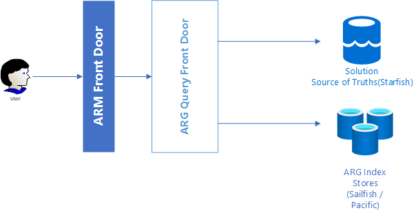
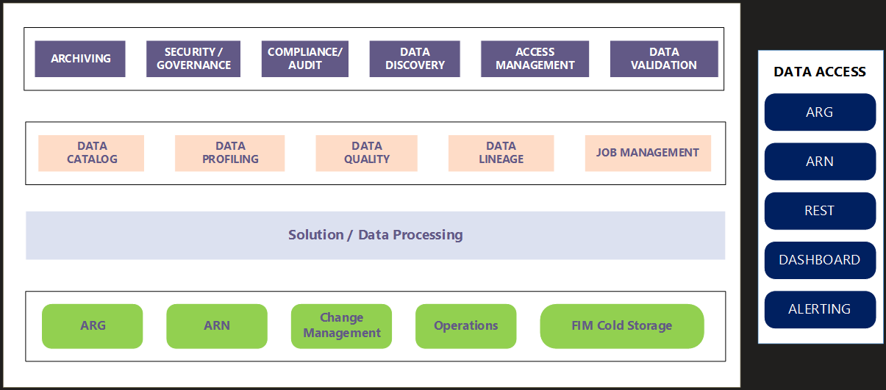

Data Labs is a platform capability in control plane which allows
partners to enrich control plane value. Partners can quickly add
capabilities and generate new (management) data types around Azure
inventory. Since these will be aligned with control plane Data Labs will
provide out of box API's as well as portal experiences and further
provide the capabilities like ARG query ability, change management,
alerting and many more.

 

This will be done by co locating their enrichment logic inside the
control plane data processing pipeline.

 

Currently management providers types are built over the base inventory
data to provide management context, In most of the cases these providers
needs to pull the data out of control plane and process it outside (and
then push back to control plane). Data Labs provides a way to co-locate
the processing path inside control plane data processing pipeline,
thereby reducing time to market. Example of such management providers
are Security, Advisor, Change, Policy, Capabilities, Dependencies and
other management data value like usages, dependencies, sku\'s, identity.

 

 

Data Labs is adding extending the capabilities available in RPaaS and
provide processing functionality.

 

 

 

Data Labs will provide following functionality

1. It will allow reduce time to market

1. It allows separation of the concerns for management providers.
    1.  business value and
    1. running/managing the service which provides basic infrastructure to support scale, high availability, BCDR.
    1. as well as alignment with other control plane services.

1. It will result in reducing the management service creation from 1
year+ to around 2 months.

 
Resource Configuration Changes is a good example here. This service
process each notification and compares it with the resource\'s previous
state to create the change object. We took 1 year for Preview and
another year to get to GA quality and primary challenge was scale (apart
from resourcing). BTW ACA team is working on this for 3+ years and they
were able to enable only subscription level Change Analysis and not able
to get to full Azure scale.

 

This project will provide centralized processing thus
storage/API's/portal blades all can be created easily

As data processing/generation is standard we will have control on the
quality/consistency as well as compliance aspect of access/privacy and
security Since API's are common we can utilize management aspects like
query-ability and alerting

# High Level Design

DataLabs is a Platform in ARG where partner can run their business logic (currently any c# program)
Idea is 

1. DataLabs platform listen ARN notification and send those ARN notifications to Partner (through nuget interface). 
2. Partner apply business logic and generate output ARN notification and those ARN notification will be published back to ARN again.

Partner just need to use interface. You can see the interface. 

https://msazure.visualstudio.com/One/_git/Mgmt-Governance-DataLabs?path=/src/DataLabs/PartnerCommon/DataLabsInterface/IDataLabsInterface.cs&version=GBmain

The interface nuget is already published in official nuget feed. Partner need to download the interface and need to implement the interface. And Partner need to upload the implemented one as nuget.

DataLabs will run the partner nuget as container inside AKS. If you have any other question, feel free to ping me. I am glad to explain more details about DataLabs.

DataLabs can support Multi-Pods(Nugets) scenario. Partner can specify resourceType/eventType/action to send input to corresponding Partner Nuget.
 
Each Nuget will be scaled out and can have different concurrency separtely so that Partner can build heavy-operation flow and lower (less scale required) flow.

## Processing Pipeline

## High Level View with Cache Support

## High Level View with Pod Details in AKS

## Query Path

# Vision

