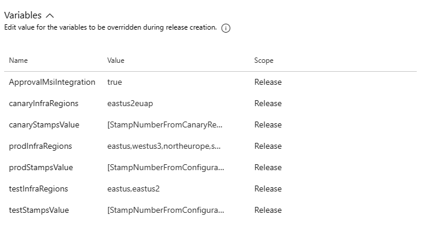
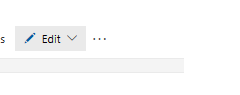
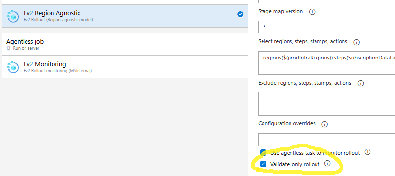
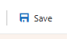
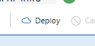

# Apps Deployment

1. Go to [ARG Datalabs Apps v2](https://dev.azure.com/msazure/One/_release?definitionId=58104&view=mine&_a=releases)
2. Create a new release
4. For first time deploy the following deployment order must be followed,
   1. Resource Fetcher monitor service, Partner monitor service
   2. Resource Fetcher service, Partner service
   3. Partner Resource fetcher proxy service, Cache service
   4. Partner IO Service
   5. > If any of the above services already exist and does not need this specific app version update, feel free to skip that deployment and continue the others in the order specified.
### To deploy only one partner
> First time deployment should follow order specified in the above section.
1. Update '{prefix}stampsValue' to x if you need to deploy just partner who is in stamp x.  For eg: 2 
   1. INT: update `testStampsValue` with StampNumber from Configuration.Int.json
   2. CANARY: update `canaryStampsValue` with StampNumber from Canary Region in Configuration.Production.json
   3. PROD: update `prodStampsValue` with StampNumber from Configuration.Production.json
2. If you want to deploy only certain regions, give the regions as a comma separated list in '{prefix}InfraRegions' For eg: northeurope,eastus
   1. INT: update `testInfraRegions`
   2. CANARY: update `canaryInfraRegions`
   3. PROD: update `prodInfraRegions`
   * 
3. Trigger all {Env}:Register xx Service stages(ones that have format"RF xx service" can be ignored), app deployment will follow immediately after as there are no approvals needed between the stages.
4. **Specifically for Canary/Prod,**
   1. By default, the validation rollout will be triggered, this can be used to double check the regions that the app is getting deployed to and the partner the app is being deployed to.
   2. If validation rollout is a success, follow the screenshots below for {Env}: xx Service
   3. Edit -> Edit release 
   * 
   1.  Go to Tasks tab, under Ev2 Region Agnostic, uncheck "validate-only rollout"
   * 
 
   1. Click Save and Deploy  
   * 
   *  

> Follow instructions in [TSG](https://eng.ms/docs/cloud-ai-platform/azure-core/azure-management-and-platforms/control-plane-bburns/azure-resource-graph/azure-resource-graph/infrastructure/deployment/regionagnosticrollouttroubleshooting) to monitor rollout further.

# Set up Data Flow

**Disclaimer**: Future flow of ARG Data Labs will primarily work through ARN. Currently, we are receiving data from ARG (Partial Sync Tracked types, no tracked Full Sync) and publish data to Multiplexers instead of ARN. ([Data Flow Diagram](https://eng.ms/docs/cloud-ai-platform/azure-core/azure-management-and-platforms/control-plane-bburns/azure-resource-graph/azure-resource-graph/datalabs/tsgs/datalabsdataflowtsg)). There is a future plan to output data to ARN.

## Steps
1. Onboard types to be published to ARN and ARG. Follow [ARN publishing onboarding](https://eng.ms/docs/cloud-ai-platform/azure-core/azure-management-and-platforms/control-plane-bburns/azure-resource-notifications/azure-resource-notifications-documentation/oncall/onboarding/publisher/publisher-onboarding-flowchart) and [ARG onboarding](https://eng.ms/docs/cloud-ai-platform/azure-core/azure-management-and-platforms/control-plane-bburns/azure-resource-graph/azure-resource-graph/write-path/cris/partner-operations/onboarding-ticket-tsg)
    - Work with ARN Hub primary oncall to create requests to onboard these new types.
    - Example: [Incident 407212833](https://portal.microsofticm.com/imp/v3/incidents/details/407212833/home) : ARN onboarding - Publisher - Production - Microsoft.DataProtection
    - Verify dataset and types exist
        - Types: [Azure Resource Graph > Onboarding > AdminTypeMetadata_list](https://portal.microsoftgeneva.com/B7802100?genevatraceguid=2adae8bb-80e2-411a-b966-8e96d768d181)
        - Dataset: [Azure Resource Graph > DatasetConfig > AdminDatasetConfiguration_List](https://portal.microsoftgeneva.com/3F4BBE18?genevatraceguid=2adae8bb-80e2-411a-b966-8e96d768d181)
2. Subscribe to ARN Notifications for input eventhubs and backup input eventhubs, ones with acronyms ip and bip usually. Create new filter rule with the types [MicrosoftResourcegraphNotificationSettings.cs](https://msazure.visualstudio.com/One/_git/Mgmt-Governance-Notifications?path=/src/Onboarding/PartnerConfiguration/PartnerConfigurations/MicrosoftResourcegraphNotificationSettings.cs)
    - Prerequisite: Input Event Hubs are already created by infrastructure
    - Example: [Pull Request 9695030: [Onboarding] Datalabs IDM int data updation](https://msazure.visualstudio.com/One/_git/Mgmt-Governance-arnpartners/pullrequest/9695030)
    - Official Documentation: [ARN Subscriber Onboarding Steps, PR Section](https://eng.ms/docs/cloud-ai-platform/azure-core/azure-management-and-platforms/control-plane-bburns/azure-resource-notifications/azure-resource-notifications-documentation/partners/subscriber/onboarding#onboarding-steps)
    - https://msazure.visualstudio.com/One/_git/Mgmt-Governance-arnpartners?path=%2Fsrc%2FOnboarding%2FPartnerConfiguration%2FPartnerConfigurations%2FMicrosoftResourcegraphNotificationSettings.cs&_a=contents&version=GBmain
3. Add multiplexer logic for downstream (send to Data Labs) code in [MultiplexerProd.cs](https://msazure.visualstudio.com/One/_git/Mgmt-Governance-ResourcesCache?path=%2Fsrc%2FDeploymentGeneration%2FConfig%2FApplications%2FMultiplexerProd.cs&_a=contents&version=GBmain) if your type is (1) a tracked type (as ARM data does not come with a properties bag and needs to go through ARG ingestion services first) or (2) requires shredding in ingestion worker service.
    - Example: [Merged PR 8622067 : [Solution] onboard abc to prod for private preview]((https://msazure.visualstudio.com/One/_git/Mgmt-Governance-ResourcesCache/commit/0a9fb127809123a825c07321a2097cf259f0088a?refName=refs/heads/main&path=/src/Libraries/SubComponents/Shared/ResourcesTopology.Contracts/FilterRules/EventHubSetFilterRules.cs)) (EventHubFilterSet was filtered to private preview types)
