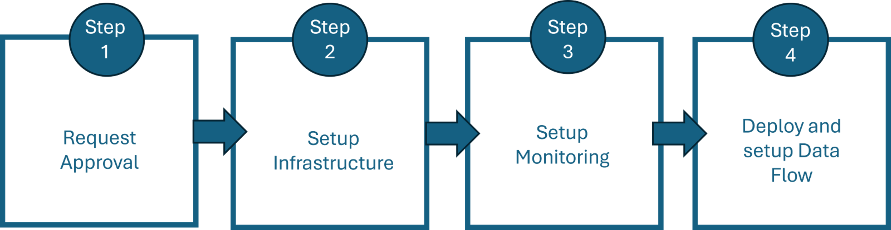

# Onboard to Azure Resource Builder DataLabs

Welcome to the DataLabs Onboarding Guide! This document serves as a comprehensive resource for teams looking to onboard Azure Resource Builder’s DataLabs offering.  

This guide will provide you with prerequisite information, detailed onboarding processes, and clear expectations to ensure a smooth and successful onboarding experience. By following the steps outlined in this guide, you'll be equipped with the knowledge and resources needed to effectively leverage DataLabs for creating your new management data type. We look forward to supporting you throughout the onboarding process.

## Prerequisites

To be eligible to onboard to DataLabs, you must have completed the following:

* A 1-pager that outlines your scenario and expected business impact. 

* If you have not onboarded to RPLite, [onboard](http://aka.ms/rplite) before requesting DataLabs approval.

* Have a complete [Geneva monitoring account](<../How-to-Guides/GenevaMonitoringGuide.md>)
  
## Highlevel Process

You will collaborate with the DataLabs team to onboard to DataLabs, develop and release your new data type. The preceding flow diagram highlights the four main onboarding steps. Links to each step's instructions cane be found on the following pages:

* [Request Approval](Submit-Request.md)
* [Setup Infrastructure](Setup-Infra.md)
* [Setup Monitoring](Setup-Monitoring.md)
* [Deploy and Setup DataFlow](Deploy-Dataflow.md)

For more details about what’s included in each step and associated time expectations refer [here](Timeline.md).

You will collaborate with the DataLabs team to onboard to DataLabs, develop and release your new data type. The preceding flow diagram highlights the four main onboarding steps. For more details about what’s included in each step and associated time expectations refer [here](Timeline.md).
