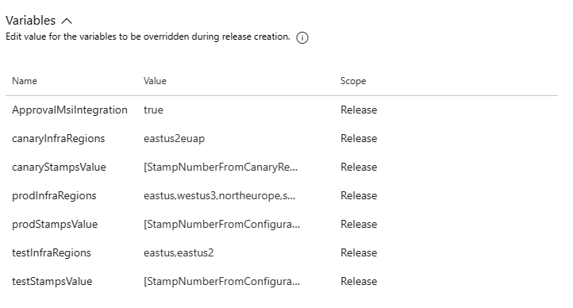

# Set up Infrastructure

**Disclaimer**: There are currently transitions for how we are doing releases for infastructure. Please reach out to @ponaraya if the instructions does not match.

## 1.File updates
1. Configuration specification 
   1. increment countOfPartner in [src/Ev2Deployment/ServiceGroupRoot/ConfigurationSpecification/Configuration.Production.json](https://msazure.visualstudio.com/One/_git/Mgmt-Governance-DataLabs?path=/src/Ev2Deployment/ServiceGroupRoot/ConfigurationSpecification/Configuration.Production.json&version=GBmain&line=7&lineEnd=7&lineStartColumn=1&lineEndColumn=29&lineStyle=plain&_a=contents) or [src/Ev2Deployment/ServiceGroupRoot/ConfigurationSpecification/Configuration.Int.json](https://msazure.visualstudio.com/One/_git/Mgmt-Governance-DataLabs?path=/src/Ev2Deployment/ServiceGroupRoot/ConfigurationSpecification/Configuration.Int.json&version=GBmain&line=6&lineEnd=6&lineStartColumn=1&lineEndColumn=25&lineStyle=plain&_a=contents)
   2. Int
      1. create new stamp_x:{} object similar to stamp_1:{} object under [eastus settings](https://msazure.visualstudio.com/One/_git/Mgmt-Governance-DataLabs?path=/src/Ev2Deployment/ServiceGroupRoot/ConfigurationSpecification/Configuration.Int.json&version=GBmain&line=20&lineEnd=20&lineStartColumn=1&lineEndColumn=31&lineStyle=plain&_a=contents) and fill in desired values for partnerName,partnerAcronym(max 3 letters).
   3. Canary
      1. create new stamp_x:{} object similar to stamp_1:{} object under [eus2euap settings](https://msazure.visualstudio.com/One/_git/Mgmt-Governance-DataLabs?path=/src/Ev2Deployment/ServiceGroupRoot/ConfigurationSpecification/Configuration.Production.json&version=GBmain&line=372&lineEnd=373&lineStartColumn=1&lineEndColumn=32&lineStyle=plain&_a=contents) and fill in desired values for partnerName,partnerAcronym(max 3 letters).
   4. Production
      1. create new stamp_x:{} object similar to stamp_1:{} object under [settings](https://msazure.visualstudio.com/One/_git/Mgmt-Governance-DataLabs?path=/src/Ev2Deployment/ServiceGroupRoot/ConfigurationSpecification/Configuration.Production.json&version=GBmain&line=3&lineEnd=3&lineStartColumn=5&lineEndColumn=15&lineStyle=plain&_a=contents) and fill in desired values for partnerName,partnerAcronym(max 3 letters).
      2. create new stamp_x:{} object similar to stamp_1:{} object under ["settings" block of all regions where partner requires presence under geographies except eus2euap](https://msazure.visualstudio.com/One/_git/Mgmt-Governance-DataLabs?path=/src/Ev2Deployment/ServiceGroupRoot/ConfigurationSpecification/Configuration.Production.json&version=GBmain&line=206&lineEnd=206&lineStartColumn=1&lineEndColumn=18&lineStyle=plain&_a=contents) and fill in the name of valuesFilename with format "{partnername}Vales_Prod_{regionacronym}.yaml"
   5. > Leave the other values as is from stamp_1 as a default for the newly created object. Please update the aks SKU here if you desire a different SKU type.
2. In [src/Ev2Deployment/Inputs/Data/StageMapData.csv](https://msazure.visualstudio.com/One/_git/Mgmt-Governance-DataLabs?path=/src/Ev2Deployment/Inputs/Data/StageMapData.csv&version=GBmain)
      1. the Stamps column, append "-{stampnumber for eg: x}" to the current value according to the regions that have the new partner.
      2. Increment version to all the rows for the related StageEnvironment.
3. Run [src/Ev2Deployment/GenerateRegionAgnosticFiles.ps1 locally](https://msazure.visualstudio.com/One/_git/Mgmt-Governance-DataLabs?path=/src/Ev2Deployment/GenerateRegionAgnosticFiles.ps1&version=GBmain).
      1. This should update the files under [src/Ev2Deployment/StageMaps](https://msazure.visualstudio.com/One/_git/Mgmt-Governance-DataLabs?path=/src/Ev2Deployment/StageMaps&version=GBmain)
      2. Commit these changes.
4.  > Confirm if the regions/subset of regions that are in the configuration is the only regions where the partners require presence. If there needs to be other regions, please reach out to @ponaraya.
5.  Create a PR and send for review.
6.  > <b>@ponaraya should be a required approver of this PR</b>

## 1.1 Register stage map
**Discalimer**: This step is being optimized so that it can be removed.
1. Open SAW, download file src/Ev2Deployment/StageMaps/src/Ev2Deployment/StageMaps/StageMap.Production.generated.json which should have the new version number.
2. Download [src/Ev2Deployment/Scripts/Ev2Scripts/RegisterStagemap.ps1](https://msazure.visualstudio.com/One/_git/Mgmt-Governance-DataLabs?path=/src/Ev2Deployment/Scripts/Ev2Scripts/RegisterStagemap.ps1&version=GBmain), update the local path to the file in step 1. Run the powershell script.

## 1.2 Register SubscriptionKey

   If you are a new partner onboarding to INT, you need to register a subscription key with INT subscription.
   To register subscription Key, please refer to this link: (https://ev2docs.azure.net/getting-started/tutorial/orchestration/subscription.html?q=backfill%20subscription&tabs=tabid-1)

   The subscriptionKey should be in a format: DataLabs(partnerAcronym)IntSubscriptionLibrarySub

   $ServiceId = "replace this with the Guid of your service, retrieved from the Service Tree portal in the prepare step of this tutorial"
   $SubscriptionIdForBackfill = "replace this with the subscription id your want to backfill"

   Register-AzureServiceSubscription -ServiceIdentifier $ServiceId -SubscriptionKey "new subscription Key" -SubscriptionId $SubscriptionIdForBackfill -RolloutInfra Test

## 2.Create new infra release 
> <b> 
>     Disclaimer: 
>         Canary deployments to EUS2EUAP requires some time for quota requests to get approved for new subscription for new partner. 
>         The first infra release for all eus2euap deployments are expected to fail due to this. We need the first release so that the subscription is created successfully, then we can create the below request.
>         TSG for creating quota request - [https://eng.ms/docs/cloud-ai-platform/azure-core/azure-core-pm-and-design/trusted-platform-pm-karimb/azure-resiliency-validation/validation-programs/canary/onboard](https://eng.ms/docs/cloud-ai-platform/azure-core/azure-core-pm-and-design/trusted-platform-pm-karimb/azure-resiliency-validation/validation-programs/canary/onboard)
>         Example quota request - [https://global.azure.com/quota/requests/10444238](https://global.azure.com/quota/requests/10444238)
>  </b>

1. Open release [https://dev.azure.com/msazure/One/_release?definitionId=58246&view=mine&_a=releases](https://dev.azure.com/msazure/One/_release?definitionId=58246&view=mine&_a=releases)
2. Click 'Create New Release'
### To deploy only one partner without resource fetcher stamp
1. Update '{prefix}stampsValue' to x if you need to deploy just partner who is in stamp x.  For eg: 2 
   1. INT: update `testStampsValue` with StampNumber from Configuration.Int.json
   2. CANARY: update `canaryStampsValue` with StampNumber from Canary Region in Configuration.Production.json
   3. PROD: update `prodStampsValue` with StampNumber from Configuration.Production.json
2. If you want to deploy only certain regions, give the regions as a comma separated list in '{prefix}InfraRegions' For eg: northeurope,eastus
   1. INT: update `testInfraRegions`
   2. CANARY: update `canaryInfraRegions`
   3. PROD: update `prodInfraRegions`
   * 
3. Trigger {Env}: Register {Env} Infra 
4. Trigger {Env}: Partner Infra
5. **Specifically for Canary/Prod,**
   1. By default, the validation rollout will be triggered which can be used to validate if all values are correct. If there are errors, please make the necessary corrections and send an update PR. Possible validation error - VMSS SKU/zones is not supported in a region. 
   2. If validation rollout is a success, follow the screenshots below for {Env}: Partner Infra
   3. Edit -> Edit release 
   * 
   1.  Go to Tasks tab, under Ev2 Region Agnostic, uncheck "validate-only rollout"
   * 
 
   1. Click Save and Deploy  
   * 
   * 
 
> Follow instructions in [TSG](https://eng.ms/docs/cloud-ai-platform/azure-core/azure-management-and-platforms/control-plane-bburns/azure-resource-graph/azure-resource-graph/infrastructure/deployment/regionagnosticrollouttroubleshooting) to monitor rollout further.

## 3.One time setup for new partner file updates
1. Update Role assignment scripts with the new partner values and the subscription. Subscription Id can be got from the previous rollout.
    1. Int- Add a partner value [ similarly in the same file](https://msazure.visualstudio.com/One/_git/Mgmt-Governance-DataLabs?path=/src/Ev2Deployment/Inputs/PartnerDetails/IntPartners.ps1)
    2. Canary -   
         a.Add a partner  [ similarly in the same file](https://msazure.visualstudio.com/One/_git/Mgmt-Governance-DataLabs?path=/src/Ev2Deployment/Inputs/PartnerDetails/CanaryPartners.ps1)   
         b.Add subscription id in "AssignableScopes" if its not already there [in this file](https://msazure.visualstudio.com/One/_git/Mgmt-Governance-DataLabs?path=/src/Ev2Deployment/Scripts/RoleAssignments/RoleDefinitionArgAksDeployScript.prod.json)   
    4. Prod -  
        a. Add a partner  [ similarly in the same file](https://msazure.visualstudio.com/One/_git/Mgmt-Governance-DataLabs?path=/src/Ev2Deployment/Inputs/PartnerDetails/ProdPartners.ps1)    
        b.Add subscription id in "AssignableScopes" if its not already there [in this file](https://msazure.visualstudio.com/One/_git/Mgmt-Governance-DataLabs?path=/src/Ev2Deployment/Scripts/RoleAssignments/RoleDefinitionArgAksDeployScript.prod.json)

2. Fill in base template configs under value files created under "src\AKSDeployment\Charts\PartnerAKS" following steps in next section.

### Steps to create values files
1. INT and Canary - 
   1. Create INT and Canary app deployment files. Please copy off of a values file that is similar to your scenario. <b>The name needs to match the file name provided in [step 1](#1file-updates)</b>
    - External Partners: Copy from `bcdrValues_Int.yaml`
    - Internal Partners: Copy from `idMappingValues_Int.yaml`
2. PROD -
   1. Build a template for the naming schemes for the partner in `src/AKSDeployment/Charts/PartnerAKS/ValuesFilesTemplates`. Please copy off of a values file that is similar to your scenario and build on the comments received from INT and Canary.
    - External Partners: Copy from `bcdrValues_Prod_template.yaml`
    - Internal Partners: Copy from `idMappingValues_Prod_Template.yaml`
   2. Update $PARTNER_INFORMATION to include new partner in `buildpartner.ps1`. Look at the examples found in `src/AKSDeployment/Charts/PartnerAKS/ValuesFilesTemplates/buildpartner.md`, and document steps that are run.
   3. Run `buildpartner.ps1`. 
3. Double check the value file has all the below values updated. Here are the list of changes needed to be done for the partner. 
    1. Updates to solutionInfo
        - Update `solutionInfo.solutionName` to `{partner_acroynm}solution`
        - Update `solutionInfo.aksClusterName` to `{partner_acroynm}{cloud}{region}aks`
        - Update `solutionInfo.environment` to `{region}`
    2. Updates to ioConfigMap (Values can be found with [Azure Resource Manager > Resource Group Management > Get resource group resources](https://portal.microsoftgeneva.com/9B40F8EA?genevatraceguid=3114d887-9c1b-471c-a6bd-927f66777216))
        - Update `ioConfigMap.inputEventHubNameSpaceAndName` to event hubs created in infra (found in `DataLabs{partner_acronym}RG-{region}` resource in portal too)
        - Update `ioConfigMap.outputEventHubNameSpaceAndName` to event hubs created in infra (found in `DataLabs{partner_acronym}RG-{region}` resource in portal too)
        - Update `ioConfigMap.eventHubStorageAccountName` to storage account created in infra (found in `DataLabs{partner_acronym}RG-{region}` resource in portal too)
        - Update `ioConfigMap.serviceBusNameSpaceAndName` to service bus created in infra (found in `DataLabs{partner_acronym}RG-{region}` resource in portal too)
        - Update `ioConfigMap.outputDataset` to dataset created in ARG Onboarding
        - Update `ioConfigMap.allowedOutputTypes` to types found in onboarding
        - Update `ioConfigMap.backupInputEventHubNameSpaceAndName` to event hubs created in infra (found in `DataLabs{partner_acronym}RG-{region}` resource in portal too)
        - Update `ioConfigMap.useSourceOfTruth` to true or false based on if you are using blob storage accounts. If true, the below values must not be empty.
          - Update `ioConfigMap.blobStorageAccountNames` to blob storage acconts created in infra (found in `DataLabs{partner_acronym}RG-{region}` resource in portal too)
          - Update `ioConfigMap.backupBlobStorageAccountNames` to blob storage accounts of paired region (found in `DataLabs{partner_acronym}RG-{backup_region}` resource in portal too)
        - Update `ioConfigMap.arnPublishStorageAccountNames` to arn publish storage accounts created in infra (found in `DataLabs{partner_acronym}RG-{region}` resource in portal too)
        - Update `ioConfigMap.arnPublishEventGridDomainIds` from arn publish event grid configs created in infra (found in `DataLabs{partner_acronym}RG-{region}` resource in portal too)
        - Update `ioConfigMap.arnPublishEventGridDomainEndpoints` from arn publish event grid configs created in infra (found in `DataLabs{partner_acronym}RG-{region}` resource in portal too)
        - Update `ioConfigMap.arnPublishEventGridTopics` from arn publish event grid configs created in infra (found in `DataLabs{partner_acronym}RG-{region}` resource in portal too)
        - Update `ioConfigMap.pairedRegionArnPublishEventGridDomainIds` from paired region arn publish event grid configs created in infra (found in `DataLabs{partner_acronym}RG-{backup_region}` resource in portal too)
        - Update `ioConfigMap.pairedRegionArnPublishEventGridDomainEndpoints` from paired region arn publish event grid configs created in infra (found in `DataLabs{partner_acronym}RG-{backup_region}` resource in portal too)
        - Update `ioConfigMap.pairedRegionArnPublishEventGridTopics` from paired region arn publish event grid configs created in infra (found in `DataLabs{partner_acronym}RG-{backup_region}` resource in portal too)
        
    3. Update `partnerConfig.pods.containers.repository` to `datalabs{cloud}acr.azurecr.io/{partner_acronym}partnersolution`
    4. Update `genevaAccounts.datalabs.miResourceId` and `genevaAccounts.partner.miResourceId` (if exists) to the value received from `(Get-AzAksCluster -ResourceGroupName $AKS_RESOURCE_GROUP -Name $AKS_NAME).IdentityProfile.kubeletidentity.ResourceId`
    5. Update the objectId's found in `mdm.configData`'s json with `(Get-AzAksCluster -ResourceGroupName $AKS_RESOURCE_GROUP -Name $AKS_NAME).IdentityProfile.kubeletidentity.objectid`

### Steps to add changes for images upload
   > Example PR - [Pull Request 9336273: Added Sku images to the image upload script](https://msazure.visualstudio.com/One/_git/Mgmt-Governance-DataLabs/pullrequest/9336273?path=/src/Ev2Deployment/ServiceGroupRoot/Rollouts/ImagesUpload/RolloutParameters)
   1. **.pipelines/OneBranch.Official.yml** - add a task similar to `displayName: build sample partner image`
   2. **/src/Ev2Deployment/Scripts/Shell/ImagesUploadToACR.sh** - update `zipTarFiles`, `tarFiles`,`repos`,`sas` to add the new partner image
   3. **/src/Ev2Deployment/ServiceGroupRoot/Rollouts/ImagesUpload/RolloutParameters/ImagesUpload.Rollout.json** - update `environmentVariables` to add a `TARBALL_IMAGE_SAS_{partnerimagename}SOLUTION`.
1. Please raise a PR and get it approved.

## 4. Create second infra release for InternalAksSetup
1. Open release [https://dev.azure.com/msazure/One/_release?definitionId=58246&view=mine&_a=releases](https://dev.azure.com/msazure/One/_release?definitionId=58246&view=mine&_a=releases)
2. Click 'Create New Release'
### To deploy only one partner without resource fetcher stamp
1. Update '{prefix}stampsValue' to x if you need to deploy just partner who is in stamp x.  For eg: 2 
   1. INT: update `testStampsValue` with StampNumber from Configuration.Int.json
   2. CANARY: update `canaryStampsValue` with StampNumber from Canary Region in Configuration.Production.json
   3. PROD: update `prodStampsValue` with StampNumber from Configuration.Production.json
2. If you want to deploy only certain regions, give the regions as a comma separated list in '{prefix}InfraRegions' For eg: northeurope,eastus
   1. INT: update `testInfraRegions`
   2. CANARY: update `canaryInfraRegions`
   3. PROD: update `prodInfraRegions`
   * 
3. Trigger {Env}: Run role assignment scripts
    1. > <b> You need subscription owner JIT for running below script. If role definition is being updated, then you need subscription owner JIT for all the subscriptions in "assignable scopes" field of the role definition script </b>
    2. Download the "src/Ev2Deployment" folder from official build - you need multiple folders from this root folder, please make sure you have the whole Ev2Deployment folder.
    3. Go to src/Ev2Deployment/Scripts/RoleAssignments/Ev2FirstTimeDeploy
    4. Run RAOps.ps1 in SAW powershell. `.\RAOps.ps1 -environmentName "<should be one of - Int/Canary/Prod>"`
4. Trigger {Env}: Register {Env} InternalAksSetup 
5. Trigger {Env}: Partner InternalAksSetup
6. **Specifically for Canary/Prod,**
   1. By default, the validation rollout will be triggered which can be used to validate if all values are correct. If there are errors, please make the necessary corrections and send an update PR. Possible validation error - VMSS SKU/zones is not supported in a region. 
   2. If validation rollout is a success, follow the screenshots below for {Env}: Partner InternalAksSetup
   3. Edit -> Edit release 
   * 
   1.  Go to Tasks tab, under Ev2 Region Agnostic, uncheck "validate-only rollout"
   * 
 
   1. Click Save and Deploy  
   * 
   *  
 
> Follow instructions in [TSG](https://eng.ms/docs/cloud-ai-platform/azure-core/azure-management-and-platforms/control-plane-bburns/azure-resource-graph/azure-resource-graph/infrastructure/deployment/regionagnosticrollouttroubleshooting) to monitor rollout further.
