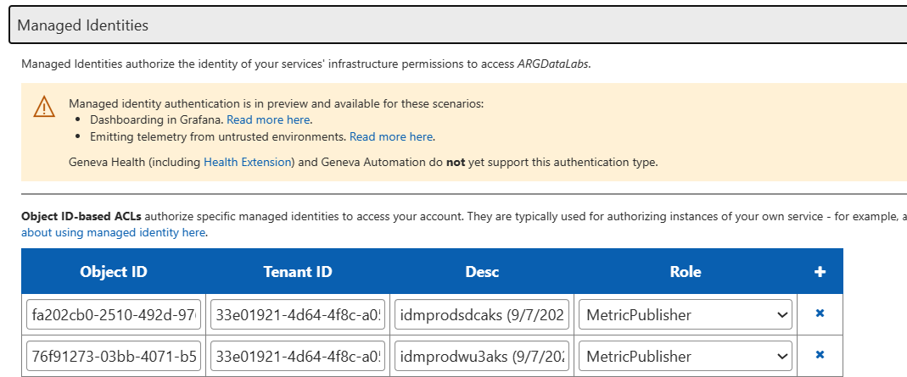
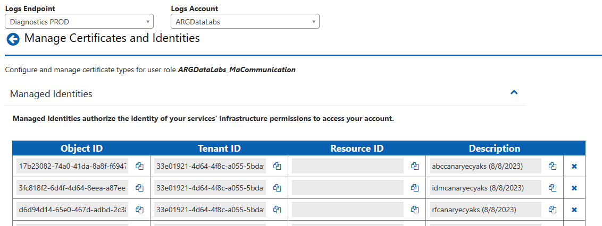
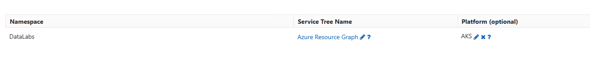
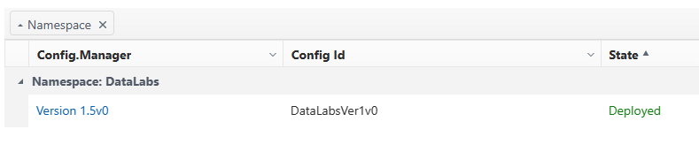

# Set up Monitoring

**NOTE**: This operation has to be done for every AKS cluster that is created. Authentication for a monitoring agent has to be done for each AKS resource and will be shared with the Geneva logging and metrics account for the partner's geneva account and Data Labs' geneva account. You can do all of these steps in parallel for all regions.

## Steps
0. Infrastructure for AKS clusters should already be deployed to refer to Managed Identities that are created.
1. Check for the AKS kubelet identity object id. For prod files, it should automatically be created from scripts (refer to `buildpartner.ps1`), but if it is not, please correct it to the following values (this is usually done for int and canary values).
    - In order to correct the values file, please replace:
        - Update the objectId's found in `mdm.configData`'s json with the object id defined below.
        - Update the `genevaAccounts.datalabs.miResourceId` (and `genevaAccounts.partner.miResourceId` if partner is external) values with the Resource ID defined below.
```
Connect-AzAccount
Select-AzSubscription -SubscriptionName $SUBSCRIPITON

(Get-AzAksCluster -ResourceGroupName $AKS_RESOURCE_GROUP -Name $AKS_NAME).IdentityProfile.kubeletidentity.objectid # Correct Object ID
(Get-AzAksCluster -ResourceGroupName $AKS_RESOURCE_GROUP -Name $AKS_NAME).IdentityProfile.kubeletidentity.ResourceId # Correct Resource ID
```
2. Add the object id and tenant id to [ARGDataLabs Geneva Metrics Account](https://portal.microsoftgeneva.com/account/metrics?account=ARGDataLabs&section=home&hideLeftNav=true) (Machine Access > Managed Identities). Don't forget to press save!
    - For INT env, please use the [DataLabs Test Geneva Metrics Account](https://portal-int.microsoftgeneva.com/account/metrics?account=DataLabs&section=home&hideLeftNav=true)
    
3. Add the object id and tenant id to [ARGDataLabs Geneva Logs Account](https://portal.microsoftgeneva.com/account/logs/userRoles?endpoint=Diagnostics%20PROD&account=ARGDataLabs) (Logs Account > User Roles > MaCommunication > Identities > Managed Identities).
    - For INT env, please use the [DataLabs Test Geneva Logs Account](https://portal-int.microsoftgeneva.com/account/logs/userRoles?endpoint=Test&account=DataLabs)
    
4. Partner Geneva Account: Ask for partner's Geneva Account name and either work with the partner primary contact or obtain temporary administrator level access for their Geneva Account. You can see this under Namespaces to see if it support Platform. For an example, please use the template email below.
5. Partner Geneva Account: Confirm that the logs account supports linux monitoring agents. It is not recommended by the Geneva team to support both Windows and Linux logs in a singular Geneva Account.

6. Partner Geneva Account: Ask the partner to make the following updates to their Geneva Namespace. This is for supporting logs scoping conditions and sending OpenTelemetry.
    - Replace \<Identity\> component with the following. This is for log scoping conditions
    ```
    <Identity>
      <IdentityComponent name="Tenant" envariable="TENANT" />
      <IdentityComponent name="Role" envariable="ROLE" />
      <IdentityComponent name="RoleInstance" envariable="ROLEINSTANCE" />
      <IdentityComponent name="NodeName" useComputerName="true" />
      <IdentityComponent name="Environment" envariable="ENVIRONMENT" />
      <IdentityComponent name="Region" envariable="REGION" />
      <IdentityComponent name="ScaleUnit" envariable="SCALE_UNIT" />
    </Identity>
    ```
    - Add the following sources to \<Sources\>. This is to support monitoring agent values coming in as Span and Log. Partners without activity tracing (non-internal partners) do not need to add the Source for ActivityStarted, ActivityFailed, and ActivityCompleted.
    ```
    <Sources>
      <!-- OTLP Traces -->
      <Source name="Span" dynamic_schema="true" />
      <Source name="Log" dynamic_schema="true" />
      <!-- Activity Tracing: PARTNERS WITHOUT ACTIVITY TRACING DON'T NEED BELOW 3 SOURCES -->
      <Source name="ActivityStarted" dynamic_schema="true" />
      <Source name="ActivityFailed" dynamic_schema="true" />
      <Source name="ActivityCompleted" dynamic_schema="true" />
      ...
    </Sources>
    ```
    - Add the following MdsdEvents to MdsdEvents, so that monitoring agent will pick these up. Partners without activity tracing (non-internal partners) do not need to add the EventSource for ActivityStarted, ActivityFailed, and ActivityCompleted.
    ```
    <Events>
      <!--Adding OTLP support here-->
      <MdsdEventSource source="Span">
        <RouteEvent eventName="Span" storeType="CentralBond" priority="High" duration="PT10S" account="datalabsdiag" />
      </MdsdEventSource>
      <MdsdEventSource source="Log">
        <RouteEvent storeType="CentralBond" duration="PT10S" eventName="Log" />
      </MdsdEventSource>
      <!-- Activity Tracing: PARTNERS WITHOUT ACTIVITY TRACING DON'T NEED BELOW 3 EVENTSOURCES -->
      <MdsdEventSource source="ActivityStarted">
        <RouteEvent storeType="CentralBond" duration="PT10S" eventName="ActivityStarted" />
      </MdsdEventSource>
      <MdsdEventSource source="ActivityFailed">
        <RouteEvent storeType="CentralBond" duration="PT10S" eventName="ActivityFailed" />
      </MdsdEventSource>
      <MdsdEventSource source="ActivityCompleted">
        <RouteEvent storeType="CentralBond" duration="PT10S" eventName="ActivityCompleted" />
      </MdsdEventSource>
      <!--end-->
      ...
    </Events>
    ```
    - Add EventStreamingAnnotation for Span to enable Traces in your Geneva Account
    ```
      <EventStreamingAnnotations>
         <EventStreamingAnnotation name="Span">
            <DistributedTracing>
               <Content><![CDATA[
               <CorrelationPlatform>
                  <TraceEventSchema>
                     <SchemaId>CommonSchema_4_0</SchemaId>
                  </TraceEventSchema>
               </CorrelationPlatform>
               ]]></Content>
            </DistributedTracing>
         </EventStreamingAnnotation>
         ...
      </EventStreamingAnnotations>
    ```
7. Ask the partner for the updated configuration namespace version for their Geneva Account. Update `genevaAccounts.partner.gcs_config_version` to the version indicated by the partner.

8. Update the logs and metrics accounts with the object id and tenant id under the partner geneva account similar to steps 2 and 3.
9. Set up is complete! Wait about 3-4 hours before deploying. The Geneva Account needs some baking time for the managed identities to appear.
