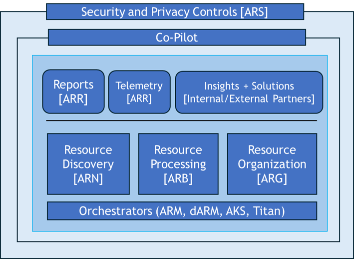

# Overview

Welcome to the **Azure Resource Builder (ARB)** product page!

Azure Resource Builder is a managed platform designed to streamline data processing for all resources within [One Inventory](https://eng.ms/docs/products/one-inventory/overview/overview). ARB aims to simplify operations across services while offering an end-to-end solution for data curation within One Inventory. With ARB in place, Azure services can focus on their core functionalities without the burden of managing infrastructure for data curation atop One Inventory.

## ARB Value

ARB’s goal is to improve One Inventory data processing and empower our customers to extend One Inventory for data curation, analytics and reporting by having the following objectives:

**#1 Service Reliability** 

ARB strives to ensure a minimum of 99.99% availability with complete data integrity and zero loss, while guaranteeing data accuracy without compromise. 

**#2 Centralized Data Curation and Analytics Engine**

ARB aims to provide a centralized and managed data curation and analytics engine for resource providers. Offer reliable curation and analytics with guaranteed delivery of processed signals through Service Level Objectives (SLOs), supporting both stream and batch capabilities. Ensure comprehensive signal coverage through meticulous late-data processing and reconciliation mechanisms, allowing for ML/analytical workloads on historical datasets. 

**#3 Programmability with Low/No-Code Templates** 

ARB offers a user-friendly, low-code approach for defining processing workflows via templates, reducing the need for complex code authoring. Support both low/no-code templates and full-rich APIs to accommodate varying levels of complexity in processing logic. 

**#4 Self-Service Onboarding & Deployment** 

ARB’s goal is to facilitate seamless onboarding and deployment experiences for both first-party (1P) and third-party (3P) customers, promoting inclusivity and accessibility. 

**#5 Privacy, Compliance, and Data Access Management** 

ARB will guarantee privacy and compliance mechanisms with clear data access limitations and auditing, ensuring data security and regulatory compliance. 

## ARB Solutions

ARB platform has various options to suit the different requirements of our customers. It's a breakthrough in the field of data processing, offering ease, dependability, and productivity. Below are explanations of each option to help you decide which one is most suitable for your data scenario. Click on the tiles below to learn more.

<table style="padding:10px 30px 10px;border:0px;border-collapse:separate; margin: 10px auto;">
  <!--First row-->
  <tr>
    <td style="padding:10px;max-width:400px;">
      <a href="https://eng.ms/docs/cloud-ai-platform/azure-core/azure-management-and-platforms/control-plane-bburns/azure-resource-builder/arb-product-docs/datalabs/overview" style="text-decoration:none;">
        

          

            
DataLabs

          

          
Leverage ARB’s pre-build templates to easily create and quickly deploy new data types from existing One Inventory data and insights with DataLabs.   

        

      </a>
    </td>
    <td style="padding:10px;max-width:400px;">
      <a href="https://eng.ms/docs/cloud-ai-platform/azure-core/azure-management-and-platforms/control-plane-bburns/azure-resource-builder/arb-product-docs/change/storageaccountsbcdr" style="text-decoration:none;">
        

          

            
Change Anaylsis

          

          
Onboard your proxy types and get tracked resource change information to know who made a change and what change they made with Change Analysis.  

        

      </a>
    </td>
  </tr>
  <!--Second row-->
  <tr>
    <td style="padding:10px;max-width:400px;">
      <a href="https://eng.ms/docs/cloud-ai-platform/azure-core/azure-management-and-platforms/control-plane-bburns/azure-resource-builder/arb-product-docs/reconcilationservice/overview" style="text-decoration:none;">
        

          

            
Reconcilation Service

          

          
Ensure data consistency and correctness for all One Inventory with reconciliation (snapshots) also known as full sync which crawls Azure every 30 hours to retrieve the latest resource states.   

        

      </a>
    </td>
    <td style="padding:10px;max-width:400px;">
      <a href="https://eng.ms/docs/cloud-ai-platform/azure-core/azure-management-and-platforms/control-plane-bburns/azure-resource-builder/arb-product-docs/bigdatalabs/overview" style="text-decoration:none;">
        

          

            
Big DataLabs

          

          
Leverage asset ownership and resource attribution of assets for our critical MSFT functions like Security and Compliance. 

        

      </a>
    </td>
  </tr>
</table>