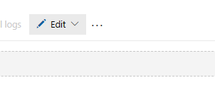
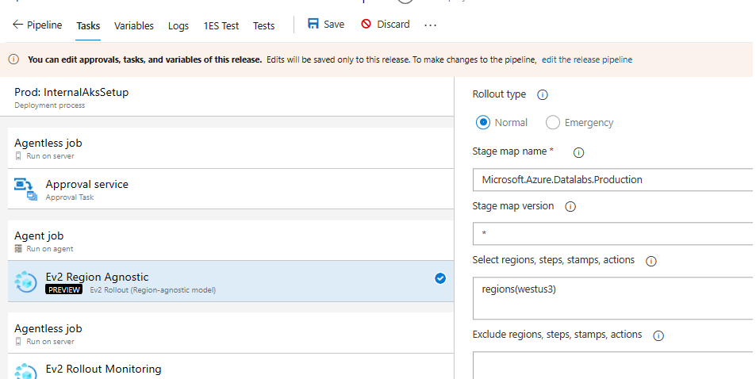

# Releases
> Use TSG for how to create new or monitor the rollout - [Region agnostic rollout troubleshooting](https://eng.ms/docs/cloud-ai-platform/azure-core/azure-management-and-platforms/control-plane-bburns/azure-resource-graph/azure-resource-graph/infrastructure/deployment/regionagnosticrollouttroubleshooting)
* ARG Datalabs Infra v2
  * [https://dev.azure.com/msazure/One/_release?definitionId=58246&view=mine&_a=releases](https://dev.azure.com/msazure/One/_release?definitionId=58246&view=mine&_a=releases)
* ARG Datalabs Apps v2
  * [https://dev.azure.com/msazure/One/_release?definitionId=58104&view=mine&_a=releases](https://dev.azure.com/msazure/One/_release?definitionId=58104&view=mine&_a=releases)
* To be deprecated
  * ARG Datalabs Infra 
    * [https://dev.azure.com/msazure/One/_release?definitionId=56263&view=mine&_a=releases](https://dev.azure.com/msazure/One/_release?definitionId=56263&view=mine&_a=releases)
  * ARG Datalabs Apps Deployment
    * [https://dev.azure.com/msazure/One/_release?definitionId=56489&view=mine&_a=releases](https://dev.azure.com/msazure/One/_release?definitionId=56489&view=mine&_a=releases)
> All rollouts should follow the SDP outlined in the stage map for normal rollouts. If there is a need to do a region specific rollout in a cloud, use the below instructions.
## Deployment in one region only
1. Create the release.
2. Edit release as below 
   1. 
3. Click Tasks Tab, Ev2 Region Agnostic under Agent Job, edit the "Select regions, steps, stamps, actions"
   1. Reference: https://ev2docs.azure.net/features/rollout-orchestration/select-regions.html?tabs=tabid-1
   2. 
   3. For one region only 
      1. the input should be regions({REGION1NAME}) eg: regions(westus3)
# Weekly Deployment schedule
TODO