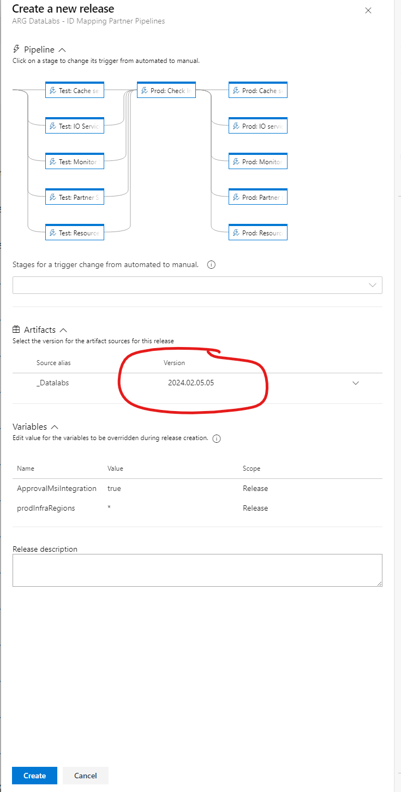
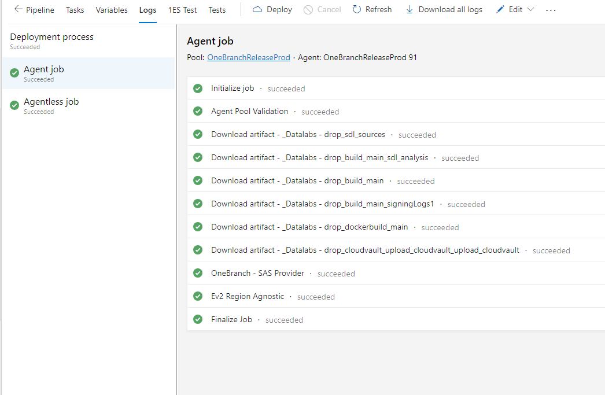
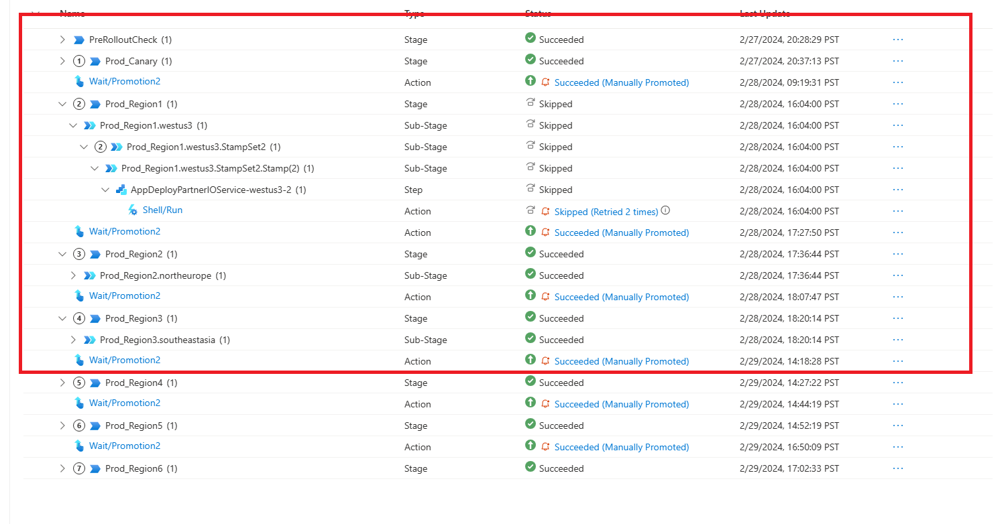
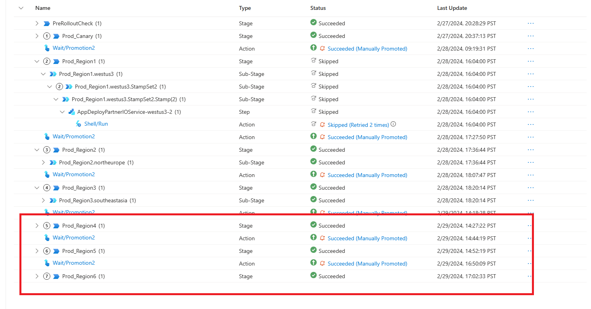
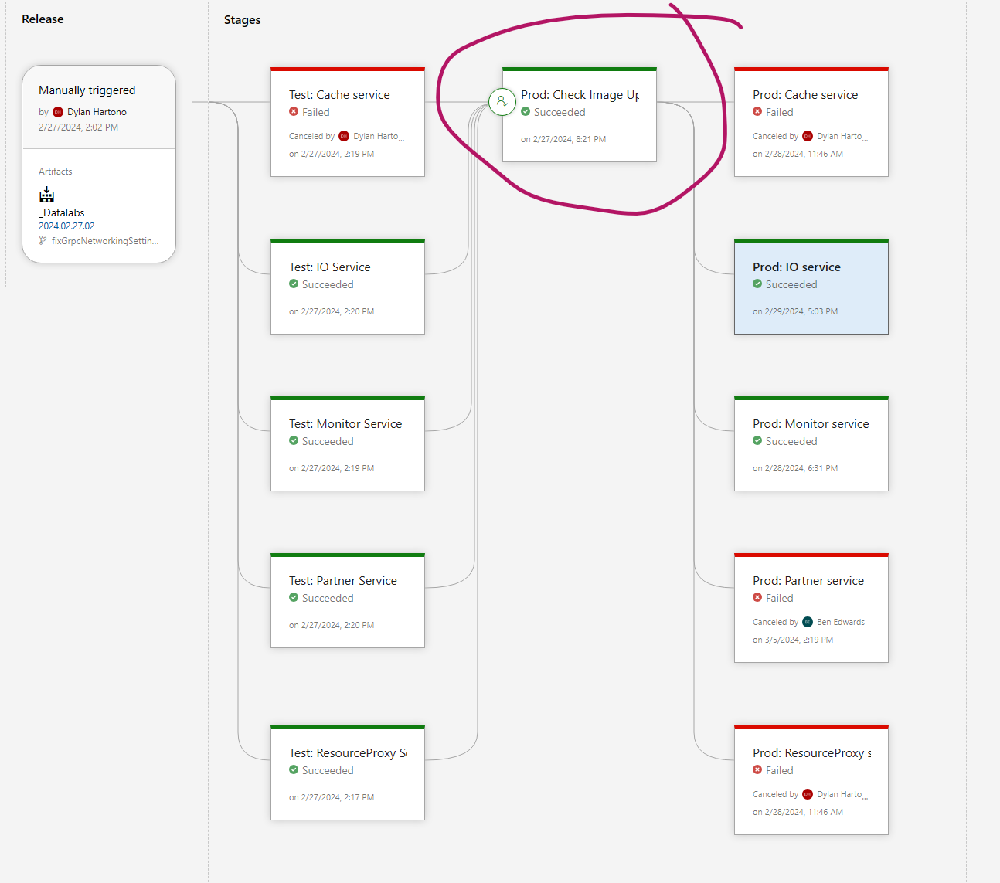
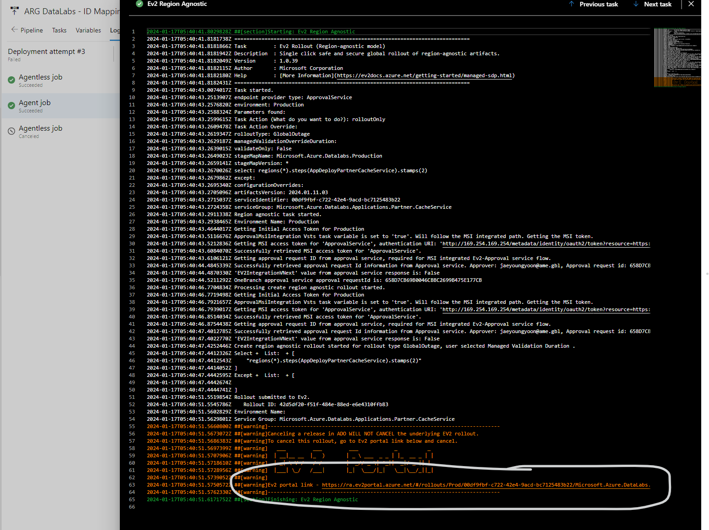
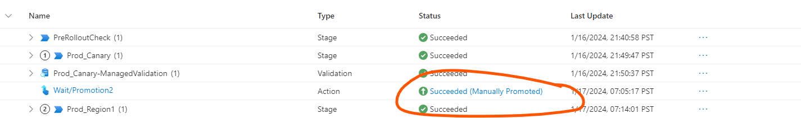

# Deployment Process with Ev2 Release

We are trying to align DataLabs IDMapping deployment train with broader One Inventory deployment train.
Note: Currently this process is just for IDMapping team but we will be adding other solutions as well soon.

## Who is responsible for approving the release to the next deployment stage?
1.	ARB Oncall : [Current ARB Oncall](https://portal.microsofticm.com/imp/v3/oncall/current?serviceId=26994&teamIds=116815&scheduleType=timeline&shiftType=current&viewType=0&gridViewStartDate=2024-01-24T08:00:00.000Z&gridViewEndDate=2024-01-31T07:59:59.999Z&gridViewSelectedDateRangeType=9); Team alias: arbtm@microsoft.com

2. The solution Team(s) 

| Solution Name | Team Alias | Team Member |
| --------- | --------- | --------- |
| IDMapping |  arnteam |  *Kairui Xu, Ben Edwards* |

ARB OnCall is responsible for:
1. Validating that these changes are safe to move to the next Production stage
2. Actually approving the next Production step of release.

## Primary Release pipelines
1. ARG DataLabs - Image Uploading and Registering Services : https://dev.azure.com/msazure/One/_release?definitionId=60180&view=mine&_a=releases
2. ARG DataLabs - ID Mapping Partner Pipelines : https://msazure.visualstudio.com/One/_release?_a=releases&view=mine&definitionId=59790

## Weekly Release Protocol:
When performing deployments the engineer in charge of the release should notify the ARB DataLabs and Solutions (IDMapping) teams via all of the following mediums:  
1. This must be conveyed via the "Azure Resource Graph V-Team -> - ResourceBuilder (DP,Change, DataLabs, FIM).
2. Additionally provide this info via email which is currently used for weekly deployment train : arnteam@microsoft.com, arbtm@microsoft.com

## Release Protocol

### Each Friday

#### Release Pipelines
1. ARG DataLabs - Image Uploading and Registering Services : https://dev.azure.com/msazure/One/_release?definitionId=60180&view=mine&_a=releases
2. ARG DataLabs - ID Mapping Partner Pipelines : https://msazure.visualstudio.com/One/_release?_a=releases&view=mine&definitionId=59790

### ARG DataLabs - Image Uploading and Registering Services Release in TEST (INT) Env

Before we run a deployment pipeline for IDMapping release, we need to trigger a release pipeline for Uploading images and registering services in TEST.

1. Click on the release pipeline (ARG DataLabs - Image Uploading and Registering Services) https://dev.azure.com/msazure/One/_release?definitionId=60180&view=mine&_a=releases, and hit *Create Release*

2. Select the version of artifacts from the dropdown from a **main** branch, put a release description and hit "Create"

3. Deploy the *TEST:Images Upload*

4. Once this is successful, Register Services will be deployed automatically: *Test:Register Cache Service, Test:Register IO Service, Test:Register Monitor Service, Test:Register PartnerService, Test:Register ResourceProxy*

### ARG DataLabs - ID Mapping Partner Pipelines Release in TEST (INT) Env
1. For TEST and PROD Release for IDMapping, we will be using the same release pipeline (ARG DataLabs - ID Mapping Partner Pipelines).
https://msazure.visualstudio.com/One/_release?_a=releases&view=mine&definitionId=59790

2.  Click on \"Create Release\"

3. Select the version of artifacts from the dropdown from a **main** branch, put a release description and hit "Create"

4.  All the Test stages, the name starts with "Test:" example:  *Test: Cache service*, *Test: IO service*, *Test: Monitor service*, *Test: Partner service*, *Test: ResourceProxy service*.
Select the services to be deployed and click "deploy". INT deployment will start for the selected version of artifacts. 

5. ARB on-call will need to do validation of release. Please reach out to ARB on-call mentioned above for deployment validation.

6. In the logs, click Ev2 Region Agnostic under Agent Job and get a EV2 portal link.
 
 

7. After the release is deployed successfully, please reach out to the ARB on-call for deployment validation and post update in the teams channel Azure Resource Graph V-Team -> ResourceBuilder (DP,Change, DataLabs, FIM)

8. If you notice failure in deployment, please reach out to ARB on-call post in the teams channel Azure Resource Graph V-Team -> - ResourceBuilder (DP,Change, DataLabs, FIM)

## Prod Deployment 

### Part 1: Each Monday

Deployment Regions:
Only Deploy each service to these regions on Prod deployment part 1 (Monday):
Prod_Canary, Prod_Region1 (westus3), Prod_Region2 (northeurope), Prod_Region3 (southeastasia)

### Prod Deplyment Part 2: Each Wednesday

Deploy to remaining regions on Prod deployment part 2 (Wednesday):
Prod_Region4 (eastus), Prod_Region5 (swedencentral), Prod_Region6 (eastasia)

### ARG DataLabs - Image Uploading and Registering Services Release in PROD Env

Before we run a deployment pipeline for IDMapping release, we need to trigger a release pipeline for Uploading images and registering services in PROD.

1. Click on the release pipeline (ARG DataLabs - Image Uploading and Registering Services) https://dev.azure.com/msazure/One/_release?definitionId=60180&view=mine&_a=releases and select use the same release pipeline as the previous test deployment.
(weekly deployment cycle should use the same release version for both test and prod).

2. Once the required release is selected, deploy *Prod: Register Image Upload*. 

3. Once this is successful, Please go ahead and deploy the following to Register Services: *Prod:Register Cache Service, Prod:Register IO Service, Prod:Register Monitor Service, Prod:Register PartnerService, Prod:Register ResourceProxy*

4. Once the above step is successful, deploy *Prod: Canary Image Upload, Prod: Prod Image Upload*.

### ARG DataLabs - ID Mapping Partner Pipelines Release in PROD Env

1. For TEST anf PROD Release for IDMapping, we will be using the same release pipeline (ARG DataLabs - ID Mapping Partner Pipelines).
https://msazure.visualstudio.com/One/_release?_a=releases&view=mine&definitionId=59790

2. ARB oncall will need to do validation of release.

3. **Prod: Check Image Upload** needs to be triggered manually
This step is a reminder to check if these steps are already completed in this pipeline for the same artifact version
https://dev.azure.com/msazure/One/_release?definitionId=60180&view=mine&_a=releases :  *Test:Register Cache Service, Test:Register IO Service, Test:Register Monitor Service, Test:Register PartnerService, Test:Register ResourceProxy* 

4. Open the particular release using the build number in *main* branch which is to be deployed to Prod. All the Prod stages, the name starts with "Prod:" example:  *Prod: Cache service*, *Prod: IO service*, *Prod: Monitor service*, *Prod: Partner service*, *Prod: ResourceProxy service*

5. Once deployment is started, click Ev2 Region Agnostic under Agent Job and get a EV2 portal link for each service that is being deployed and follow the below steps for all the services. 

  

6. Once the deployment succeeds for each region, please reach out to ARB on-call for validation. ARB on-call should be clicking on the three dots on the right side (...), to manually promote each region.

 

### Deployment Failures

1. If you see `BadGatewayConnection` errors, retrying should fix as these are usually transient
2. If you see `Are any of the pods older than 15 mins : true`, it's possible that deployment actually succeeded but EV2 is mistakenly showing it as failed. Use this [dashboard](https://portal.microsoftgeneva.com/s/693E6A02) to see if the bits properly switched (make sure to switch the `region`, `scaleUnit`, and `service` to the one that you are investigating)
3. For other failures in deployment, please reach out to ARB on-call as mentioned above and post in the teams channel Azure Resource Graph V-Team -> ResourceBuilder (DP,Change, DataLabs, FIM).

