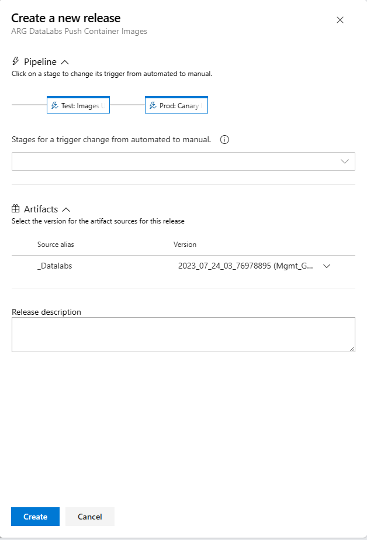
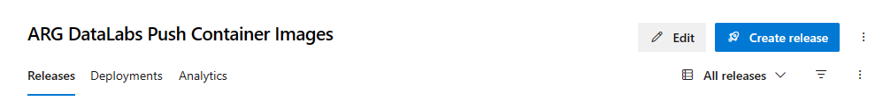
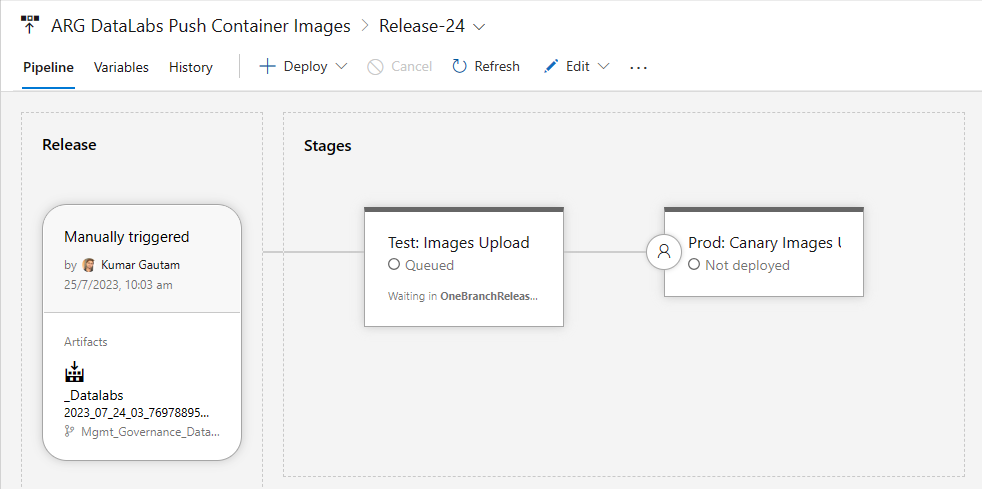
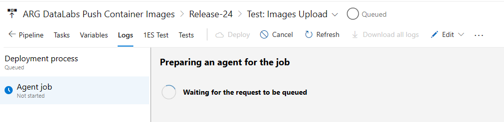

# Ev2 release pipelines

ARG data labs infra release pipeline - [Releases - Pipelines
(visualstudio.com)](https://msazure.visualstudio.com/One/_release?_a=releases&view=mine&definitionId=56263)
**-** Good to know, people who are working on infra setup would be using
this pipeline.

**[INT environment]**

Currently ABC partner solution new build out is a 2 step process

**1st step**

Images upload to ACR - [Releases - Pipelines
(visualstudio.com)](https://msazure.visualstudio.com/One/_release?_a=releases&view=mine&definitionId=56278)

a.  Click on \"Create Release\"

b.  Select the version of artifacts from the dropdown, put a release
    description and hit \"Create\"

c.  INT deployment will start for that version of artifacts.

d.  You could track the deployment from logs

**2nd step**

Apps deployment to AKS - [Releases - Pipelines
(visualstudio.com)](https://msazure.visualstudio.com/One/_release?view=mine&_a=releases&definitionId=56489)

Follow the same steps as Images upload.

**[Canary environment]**

The difference between INT & Canary is that Canary requires

1.  a pre-deployment approval condition - People who can approve in this
    step are Data Labs team under Chirag, Arpita and KG.

2.  Deployment approval - Chirag, Jae, KG, Arpita, Rama are the
    approvers.

Approver needs a SAW machine and ame.gbl account to approve. Approvers
are a part of AME/AP-ResourceTopology.
