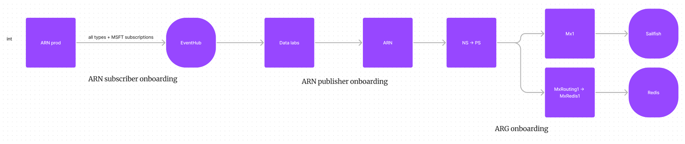
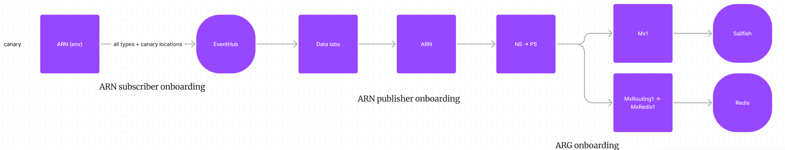
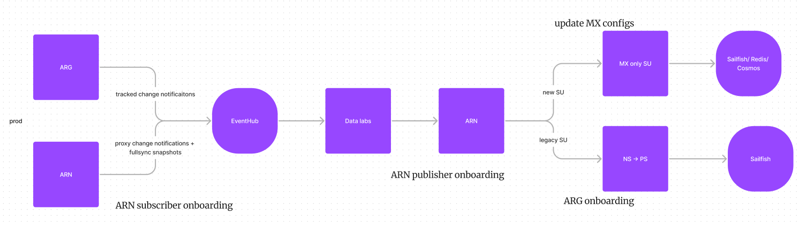

# Data Flow Configuration

Data labs currently has three environments.

## Int

The overall data flow is as .

ARN sends all the input to the data labs' input EventHubs. The process follows [ARN subscriber onboarding](https://eng.ms/docs/cloud-ai-platform/azure-core/azure-management-and-platforms/control-plane-bburns/azure-resource-notifications/azure-resource-notifications-documentation/partners/subscriber/onboarding). Only that, ARN DF usually does not have enough data. Therefore, we onboard the int EventHubs to ARN's Prod regions. To do this, we need to filter the input by MSFT subscriotoions.

Data labs' output are sent to ARN. The process exactly follows [ARN publisher onboarding](https://eng.ms/docs/cloud-ai-platform/azure-core/azure-management-and-platforms/control-plane-bburns/azure-resource-notifications/azure-resource-notifications-documentation/partners/publisher/onboarding).

To ingest the data labs output to store, the process exactly follows [ARG onboarding](https://eng.ms/docs/cloud-ai-platform/azure-core/azure-management-and-platforms/control-plane-bburns/azure-resource-graph/azure-resource-graph/write-path/cris/partner-operations/onboarding-ticket-tsg).

## Canary

The overall data flow is as .

ARN sends all the input to the data labs' input EventHubs. The process follows [ARN subscriber onboarding](https://eng.ms/docs/cloud-ai-platform/azure-core/azure-management-and-platforms/control-plane-bburns/azure-resource-notifications/azure-resource-notifications-documentation/partners/subscriber/onboarding). The canary EventHubs are onboarded to ARN's Prod regions, and only receive canary resources.

Data labs' output are sent to ARN. The process exactly follows [ARN publisher onboarding](https://eng.ms/docs/cloud-ai-platform/azure-core/azure-management-and-platforms/control-plane-bburns/azure-resource-notifications/azure-resource-notifications-documentation/partners/publisher/onboarding).

To ingest the data labs output to store, the process exactly follows [ARG onboarding](https://eng.ms/docs/cloud-ai-platform/azure-core/azure-management-and-platforms/control-plane-bburns/azure-resource-graph/azure-resource-graph/write-path/cris/partner-operations/onboarding-ticket-tsg).

## PRod

The overall data flow is as .

ARN sends all fullsync snapshots and proxy change notifications to the data labs' input EventHubs. MxPrt1 sends tracked chagne notifications to the data labs' input EventHubs.

ARN's process follows [ARN subscriber onboarding](https://eng.ms/docs/cloud-ai-platform/azure-core/azure-management-and-platforms/control-plane-bburns/azure-resource-notifications/azure-resource-notifications-documentation/partners/subscriber/onboarding).

For MxPrt1, the onboarding process is as follows:

1. Add a type/action/etc. based filter to [EventHubSetFilterRules](https://msazure.visualstudio.com/One/_git/Mgmt-Governance-ResourcesCache?path=/src/Libraries/SubComponents/Shared/ResourcesTopology.Contracts/FilterRules/EventHubSetFilterRules.cs)
2. Update [MxPrt1 configs](https://msazure.visualstudio.com/One/_git/Mgmt-Governance-ResourcesCache?path=/src/DeploymentGeneration/Config/Applications/MultiplexerProd.cs&version=GBmain&line=253&lineEnd=257&lineStartColumn=21&lineEndColumn=55&lineStyle=plain&_a=contents):
    - outgoingConnectionConfig/eventHubNamesMapString
    - outgoingConnectionConfig/eventHubSetPartitioningConfigurations
    - outgoingConnectionConfig/eventHubPathToMessageFilterOverrideMap
    - outgoingConnectionConfig/eventHubSetEventHubSelectionPolicy
    - solutionUpstreamConfigs/solutionUpstreamEventHubSet

Data labs' output are sent to ARN. The process exactly follows [ARN publisher onboarding](https://eng.ms/docs/cloud-ai-platform/azure-core/azure-management-and-platforms/control-plane-bburns/azure-resource-notifications/azure-resource-notifications-documentation/partners/publisher/onboarding).

To ingest the data labs output to store, if the partner has a legacy SU, which consists of notificaiton service and partial sync, the output ingestion should align with the existing SU. The process exactly follows [ARG onboarding](https://eng.ms/docs/cloud-ai-platform/azure-core/azure-management-and-platforms/control-plane-bburns/azure-resource-graph/azure-resource-graph/write-path/cris/partner-operations/onboarding-ticket-tsg).

If the partner has a MX only SU, we need to update below [configs](https://msazure.visualstudio.com/One/_git/Mgmt-Governance-ResourcesCache?path=/src/ResourcesCacheMultiplexer/ResourcesCacheMultiplexer/ApplicationPackageRoot/ApplicationManifest.xml&version=GBmain&line=320&lineEnd=348&lineStartColumn=10&lineEndColumn=76&lineStyle=plain&_a=contents):

1. IngestionTypeToDatasetMapping: add types to dataset mapping