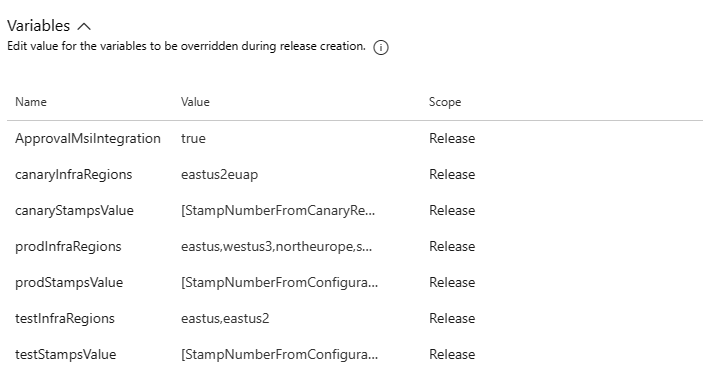
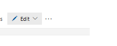
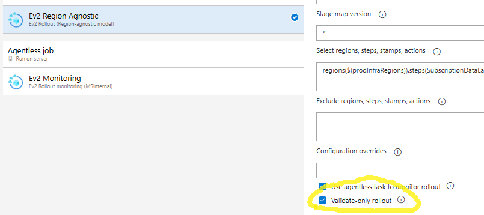
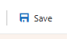
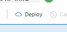
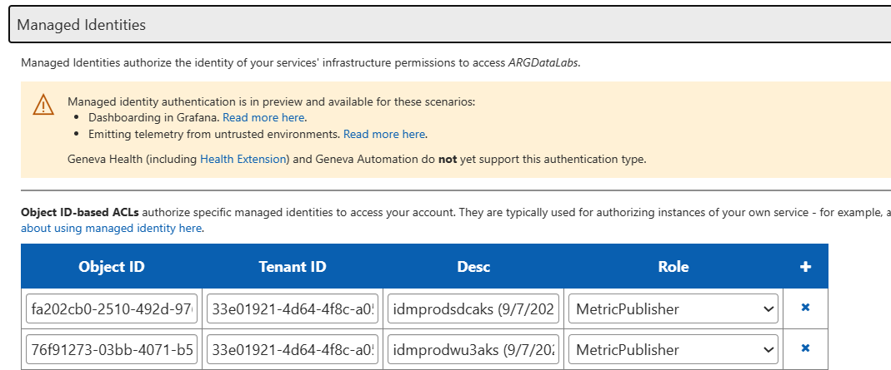
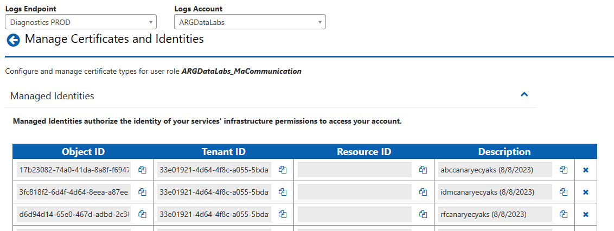
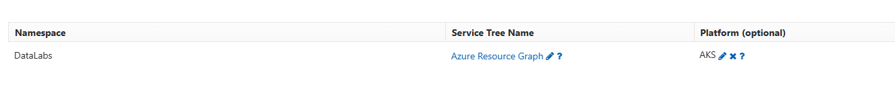

# Data Labs Onboarding: Oncall Operations

For onboarding new partners into Data Labs, please have the customer fill out the Data Labs Onboarding email and send to CPSP@microsoft.com (please refer to [Data Labs Partner Onboarding Guide](./Data-Labs-Partner.md). Also, please follow up with partner specifically with monitoring accounts as failures there will prevent app deployment.

Onboarding steps will require one SDP from ARN and Data Labs, so it can be estimated that it will take 2-3 weeks to complete onboarding as onboarding is relatively new and will have gaps.


# Infrastructure

**Disclaimer**: There are currently transitions for how we are doing releases for infastructure. Please reach out to @ponaraya if the instructions does not match.

## 1.File updates
1. Configuration specification 
   1. increment countOfPartner in [src/Ev2Deployment/ServiceGroupRoot/ConfigurationSpecification/Configuration.Production.json](https://msazure.visualstudio.com/One/_git/Mgmt-Governance-DataLabs?path=/src/Ev2Deployment/ServiceGroupRoot/ConfigurationSpecification/Configuration.Production.json&version=GBmain&line=7&lineEnd=7&lineStartColumn=1&lineEndColumn=29&lineStyle=plain&_a=contents) or [src/Ev2Deployment/ServiceGroupRoot/ConfigurationSpecification/Configuration.Int.json](https://msazure.visualstudio.com/One/_git/Mgmt-Governance-DataLabs?path=/src/Ev2Deployment/ServiceGroupRoot/ConfigurationSpecification/Configuration.Int.json&version=GBmain&line=6&lineEnd=6&lineStartColumn=1&lineEndColumn=25&lineStyle=plain&_a=contents)
   2. Int
      1. create new stamp_x:{} object similar to stamp_1:{} object under [eastus settings](https://msazure.visualstudio.com/One/_git/Mgmt-Governance-DataLabs?path=/src/Ev2Deployment/ServiceGroupRoot/ConfigurationSpecification/Configuration.Int.json&version=GBmain&line=20&lineEnd=20&lineStartColumn=1&lineEndColumn=31&lineStyle=plain&_a=contents) and fill in desired values for partnerName,partnerAcronym(max 3 letters).
   3. Canary
      1. create new stamp_x:{} object similar to stamp_1:{} object under [eus2euap settings](https://msazure.visualstudio.com/One/_git/Mgmt-Governance-DataLabs?path=/src/Ev2Deployment/ServiceGroupRoot/ConfigurationSpecification/Configuration.Production.json&version=GBmain&line=372&lineEnd=373&lineStartColumn=1&lineEndColumn=32&lineStyle=plain&_a=contents) and fill in desired values for partnerName,partnerAcronym(max 3 letters).
   4. Production
      1. create new stamp_x:{} object similar to stamp_1:{} object under [settings](https://msazure.visualstudio.com/One/_git/Mgmt-Governance-DataLabs?path=/src/Ev2Deployment/ServiceGroupRoot/ConfigurationSpecification/Configuration.Production.json&version=GBmain&line=3&lineEnd=3&lineStartColumn=5&lineEndColumn=15&lineStyle=plain&_a=contents) and fill in desired values for partnerName,partnerAcronym(max 3 letters).
      2. create new stamp_x:{} object similar to stamp_1:{} object under ["settings" block of all regions where partner requires presence under geographies except eus2euap](https://msazure.visualstudio.com/One/_git/Mgmt-Governance-DataLabs?path=/src/Ev2Deployment/ServiceGroupRoot/ConfigurationSpecification/Configuration.Production.json&version=GBmain&line=206&lineEnd=206&lineStartColumn=1&lineEndColumn=18&lineStyle=plain&_a=contents) and fill in the name of valuesFilename with format "{partnername}Vales_Prod_{regionacronym}.yaml"
   5. > Leave the other values as is from stamp_1 as a default for the newly created object. Please update the aks SKU here if you desire a different SKU type.
2. In [src/Ev2Deployment/Inputs/Data/StageMapData.csv](https://msazure.visualstudio.com/One/_git/Mgmt-Governance-DataLabs?path=/src/Ev2Deployment/Inputs/Data/StageMapData.csv&version=GBmain)
      1. the Stamps column, append "-{stampnumber for eg: x}" to the current value according to the regions that have the new partner.
      2. Increment version to all the rows for the related StageEnvironment.
3. Run [src/Ev2Deployment/GenerateRegionAgnosticFiles.ps1 locally](https://msazure.visualstudio.com/One/_git/Mgmt-Governance-DataLabs?path=/src/Ev2Deployment/GenerateRegionAgnosticFiles.ps1&version=GBmain).
      1. This should update the files under [src/Ev2Deployment/StageMaps](https://msazure.visualstudio.com/One/_git/Mgmt-Governance-DataLabs?path=/src/Ev2Deployment/StageMaps&version=GBmain)
      2. Commit these changes.
4.  > Confirm if the regions/subset of regions that are in the configuration is the only regions where the partners require presence. If there needs to be other regions, please reach out to @ponaraya.
5.  Create a PR and send for review.
6.  > <b>@ponaraya should be a required approver of this PR</b>

## 1.1 Register stage map
**Discalimer**: This step is being optimized so that it can be removed.
To run this step in SAW, you need to run it in Azure EV2 powershell. You can download it [here](https://ev2docs.azure.net/references/cmdlets/Intro.html#saw-machine) 

1. Open SAW, download file src/Ev2Deployment/StageMaps/src/Ev2Deployment/StageMaps/StageMap.Production.generated.json which should have the new version number.
2. Download [src/Ev2Deployment/Scripts/Ev2Scripts/RegisterStagemap.ps1](https://msazure.visualstudio.com/One/_git/Mgmt-Governance-DataLabs?path=/src/Ev2Deployment/Scripts/Ev2Scripts/RegisterStagemap.ps1&version=GBmain), update the local path to the file in step 1. Run the powershell script.

## 1.2 Register SubscriptionKey

   If you are a new partner onboarding to INT, you need to register a subscription key with INT subscription.
   To register subscription Key, please refer to this link: (https://ev2docs.azure.net/getting-started/tutorial/orchestration/subscription.html?q=backfill%20subscription&tabs=tabid-1)

   The subscriptionKey should be in a format: DataLabs(partnerAcronym)IntSubscriptionLibrarySub

   $ServiceId = "replace this with the Guid of your service, retrieved from the Service Tree portal in the prepare step of this tutorial"
   $SubscriptionIdForBackfill = "replace this with the subscription id your want to backfill"

   Register-AzureServiceSubscription -ServiceIdentifier $ServiceId -SubscriptionKey "new subscription Key" -SubscriptionId $SubscriptionIdForBackfill -RolloutInfra Test

## 2.Create new infra release 
> <b> 
>     Disclaimer: 
>         Canary deployments to EUS2EUAP requires some time for quota requests to get approved for new subscription for new partner. 
>         The first infra release for all eus2euap deployments are expected to fail due to this. We need the first release so that the subscription is created successfully, then we can create the below request.
>         TSG for creating quota request - [https://eng.ms/docs/cloud-ai-platform/azure-core/azure-core-pm-and-design/trusted-platform-pm-karimb/azure-resiliency-validation/validation-programs/canary/onboard](https://eng.ms/docs/cloud-ai-platform/azure-core/azure-core-pm-and-design/trusted-platform-pm-karimb/azure-resiliency-validation/validation-programs/canary/onboard)
>         Example quota request - [https://global.azure.com/quota/requests/10444238](https://global.azure.com/quota/requests/10444238)
>  </b>

1. Open release [https://dev.azure.com/msazure/One/_release?definitionId=58246&view=mine&_a=releases](https://dev.azure.com/msazure/One/_release?definitionId=58246&view=mine&_a=releases)
2. Click 'Create New Release'
### To deploy only one partner without resource fetcher stamp
1. Update '{prefix}stampsValue' to x if you need to deploy just partner who is in stamp x.  For eg: 2 
   1. INT: update `testStampsValue` with StampNumber from Configuration.Int.json
   2. CANARY: update `canaryStampsValue` with StampNumber from Canary Region in Configuration.Production.json
   3. PROD: update `prodStampsValue` with StampNumber from Configuration.Production.json
2. If you want to deploy only certain regions, give the regions as a comma separated list in '{prefix}InfraRegions' For eg: northeurope,eastus
   1. INT: update `testInfraRegions`
   2. CANARY: update `canaryInfraRegions`
   3. PROD: update `prodInfraRegions`
   * 
3. Trigger {Env}: Register {Env} Infra 
4. Trigger {Env}: Partner Infra
5. **Specifically for Canary/Prod,**
   1. By default, the validation rollout will be triggered which can be used to validate if all values are correct. If there are errors, please make the necessary corrections and send an update PR. Possible validation error - VMSS SKU/zones is not supported in a region. 
   2. If validation rollout is a success, follow the screenshots below for {Env}: Partner Infra
   3. Edit -> Edit release 
   * 
   1.  Go to Tasks tab, under Ev2 Region Agnostic, uncheck "validate-only rollout"
   * 
 
   1. Click Save and Deploy  
   * 
   *  
 
> Follow instructions in [TSG](https://eng.ms/docs/cloud-ai-platform/azure-core/azure-management-and-platforms/control-plane-bburns/azure-resource-graph/azure-resource-graph/infrastructure/deployment/regionagnosticrollouttroubleshooting) to monitor rollout further.

## 3.One time setup for new partner file updates
1. Update Role assignment scripts with the new partner values and the subscription. Subscription Id can be got from the previous rollout.
    1. Int- Add a partner value [ similarly in the same file](https://msazure.visualstudio.com/One/_git/Mgmt-Governance-DataLabs?path=/src/Ev2Deployment/Inputs/PartnerDetails/IntPartners.ps1)
    2. Canary -   
         a.Add a partner  [ similarly in the same file](https://msazure.visualstudio.com/One/_git/Mgmt-Governance-DataLabs?path=/src/Ev2Deployment/Inputs/PartnerDetails/CanaryPartners.ps1)   
         b.Add subscription id in "AssignableScopes" if its not already there [in this file](https://msazure.visualstudio.com/One/_git/Mgmt-Governance-DataLabs?path=/src/Ev2Deployment/Scripts/RoleAssignments/RoleDefinitionArgAksDeployScript.prod.json)   
    4. Prod -  
        a. Add a partner  [ similarly in the same file](https://msazure.visualstudio.com/One/_git/Mgmt-Governance-DataLabs?path=/src/Ev2Deployment/Inputs/PartnerDetails/ProdPartners.ps1)    
        b.Add subscription id in "AssignableScopes" if its not already there [in this file](https://msazure.visualstudio.com/One/_git/Mgmt-Governance-DataLabs?path=/src/Ev2Deployment/Scripts/RoleAssignments/RoleDefinitionArgAksDeployScript.prod.json)

2. Fill in base template configs under value files created under "src\AKSDeployment\Charts\PartnerAKS" following steps in next section.

### Steps to create values files
1. INT and Canary - 
   1. Create INT and Canary app deployment files. Please copy off of a values file that is similar to your scenario. <b>The name needs to match the file name provided in [step 1](#1file-updates)</b>
    - External Partners: Copy from `bcdrValues_Int.yaml`
    - Internal Partners: Copy from `idMappingValues_Int.yaml`
2. PROD -
   1. Build a template for the naming schemes for the partner in `src/AKSDeployment/Charts/PartnerAKS/ValuesFilesTemplates`. Please copy off of a values file that is similar to your scenario and build on the comments received from INT and Canary.
    - External Partners: Copy from `bcdrValues_Prod_template.yaml`
    - Internal Partners: Copy from `idMappingValues_Prod_Template.yaml`
   2. Update $PARTNER_INFORMATION to include new partner in `buildpartner.ps1`. Look at the examples found in `src/AKSDeployment/Charts/PartnerAKS/ValuesFilesTemplates/buildpartner.md`, and document steps that are run.
   3. Run `buildpartner.ps1`. 
3. Double check the value file has all the below values updated. Here are the list of changes needed to be done for the partner. 
    1. Updates to solutionInfo
        - Update `solutionInfo.solutionName` to `{partner_acroynm}solution`
        - Update `solutionInfo.aksClusterName` to `{partner_acroynm}{cloud}{region}aks`
        - Update `solutionInfo.environment` to `{region}`
    2. Updates to ioConfigMap (Values can be found with [Azure Resource Manager > Resource Group Management > Get resource group resources](https://portal.microsoftgeneva.com/9B40F8EA?genevatraceguid=3114d887-9c1b-471c-a6bd-927f66777216))
        - Update `ioConfigMap.inputEventHubNameSpaceAndName` to event hubs created in infra (found in `DataLabs{partner_acronym}RG-{region}` resource in portal too)
        - Update `ioConfigMap.outputEventHubNameSpaceAndName` to event hubs created in infra (found in `DataLabs{partner_acronym}RG-{region}` resource in portal too)
        - Update `ioConfigMap.eventHubStorageAccountName` to storage account created in infra (found in `DataLabs{partner_acronym}RG-{region}` resource in portal too)
        - Update `ioConfigMap.serviceBusNameSpaceAndName` to service bus created in infra (found in `DataLabs{partner_acronym}RG-{region}` resource in portal too)
        - Update `ioConfigMap.outputDataset` to dataset created in ARG Onboarding
        - Update `ioConfigMap.allowedOutputTypes` to types found in onboarding
        - Update `ioConfigMap.backupInputEventHubNameSpaceAndName` to event hubs created in infra (found in `DataLabs{partner_acronym}RG-{region}` resource in portal too)
        - Update `ioConfigMap.useSourceOfTruth` to true or false based on if you are using blob storage accounts. If true, the below values must not be empty.
          - Update `ioConfigMap.blobStorageAccountNames` to blob storage acconts created in infra (found in `DataLabs{partner_acronym}RG-{region}` resource in portal too)
          - Update `ioConfigMap.backupBlobStorageAccountNames` to blob storage accounts of paired region (found in `DataLabs{partner_acronym}RG-{backup_region}` resource in portal too)
        - Update `ioConfigMap.arnPublishStorageAccountNames` to arn publish storage accounts created in infra (found in `DataLabs{partner_acronym}RG-{region}` resource in portal too)
        - Update `ioConfigMap.arnPublishEventGridDomainIds` from arn publish event grid configs created in infra (found in `DataLabs{partner_acronym}RG-{region}` resource in portal too)
        - Update `ioConfigMap.arnPublishEventGridDomainEndpoints` from arn publish event grid configs created in infra (found in `DataLabs{partner_acronym}RG-{region}` resource in portal too)
        - Update `ioConfigMap.arnPublishEventGridTopics` from arn publish event grid configs created in infra (found in `DataLabs{partner_acronym}RG-{region}` resource in portal too)
        - Update `ioConfigMap.pairedRegionArnPublishEventGridDomainIds` from paired region arn publish event grid configs created in infra (found in `DataLabs{partner_acronym}RG-{backup_region}` resource in portal too)
        - Update `ioConfigMap.pairedRegionArnPublishEventGridDomainEndpoints` from paired region arn publish event grid configs created in infra (found in `DataLabs{partner_acronym}RG-{backup_region}` resource in portal too)
        - Update `ioConfigMap.pairedRegionArnPublishEventGridTopics` from paired region arn publish event grid configs created in infra (found in `DataLabs{partner_acronym}RG-{backup_region}` resource in portal too)
        
    3. Update `partnerConfig.pods.containers.repository` to `datalabs{cloud}acr.azurecr.io/{partner_acronym}partnersolution`
    4. Update `genevaAccounts.datalabs.miResourceId` and `genevaAccounts.partner.miResourceId` (if exists) to the value received from `(Get-AzAksCluster -ResourceGroupName $AKS_RESOURCE_GROUP -Name $AKS_NAME).IdentityProfile.kubeletidentity.ResourceId`
    5. Update the objectId's found in `mdm.configData`'s json with `(Get-AzAksCluster -ResourceGroupName $AKS_RESOURCE_GROUP -Name $AKS_NAME).IdentityProfile.kubeletidentity.objectid`

### Steps to add changes for images upload
   > Example PR - [Pull Request 9336273: Added Sku images to the image upload script](https://msazure.visualstudio.com/One/_git/Mgmt-Governance-DataLabs/pullrequest/9336273?path=/src/Ev2Deployment/ServiceGroupRoot/Rollouts/ImagesUpload/RolloutParameters)
   1. **.pipelines/OneBranch.Official.yml** - add a task similar to `displayName: build sample partner image`
   2. **/src/Ev2Deployment/Scripts/Shell/ImagesUploadToACR.sh** - update `zipTarFiles`, `tarFiles`,`repos`,`sas` to add the new partner image
   3. **/src/Ev2Deployment/ServiceGroupRoot/Rollouts/ImagesUpload/RolloutParameters/ImagesUpload.Rollout.json** - update `environmentVariables` to add a `TARBALL_IMAGE_SAS_{partnerimagename}SOLUTION`.
1. Please raise a PR and get it approved.

## 4. Create second infra release for InternalAksSetup
1. Open release [https://dev.azure.com/msazure/One/_release?definitionId=58246&view=mine&_a=releases](https://dev.azure.com/msazure/One/_release?definitionId=58246&view=mine&_a=releases)
2. Click 'Create New Release'
### To deploy only one partner without resource fetcher stamp
1. Update '{prefix}stampsValue' to x if you need to deploy just partner who is in stamp x.  For eg: 2 
   1. INT: update `testStampsValue` with StampNumber from Configuration.Int.json
   2. CANARY: update `canaryStampsValue` with StampNumber from Canary Region in Configuration.Production.json
   3. PROD: update `prodStampsValue` with StampNumber from Configuration.Production.json
2. If you want to deploy only certain regions, give the regions as a comma separated list in '{prefix}InfraRegions' For eg: northeurope,eastus
   1. INT: update `testInfraRegions`
   2. CANARY: update `canaryInfraRegions`
   3. PROD: update `prodInfraRegions`
   * 
3. Trigger {Env}: Run role assignment scripts
    1. > <b> You need subscription owner JIT for running below script. If role definition is being updated, then you need subscription owner JIT for all the subscriptions in "assignable scopes" field of the role definition script </b>
    2. Download the "src/Ev2Deployment" folder from official build - you need multiple folders from this root folder, please make sure you have the whole Ev2Deployment folder.
    3. Go to src/Ev2Deployment/Scripts/RoleAssignments/Ev2FirstTimeDeploy
    4. Run RAOps.ps1 in SAW powershell. `.\RAOps.ps1 -environmentName "<should be one of - Int/Canary/Prod>"`
4. Trigger {Env}: Register {Env} InternalAksSetup 
5. Trigger {Env}: Partner InternalAksSetup
6. **Specifically for Canary/Prod,**
   1. By default, the validation rollout will be triggered which can be used to validate if all values are correct. If there are errors, please make the necessary corrections and send an update PR. Possible validation error - VMSS SKU/zones is not supported in a region. 
   2. If validation rollout is a success, follow the screenshots below for {Env}: Partner InternalAksSetup
   3. Edit -> Edit release 
   * 
   1.  Go to Tasks tab, under Ev2 Region Agnostic, uncheck "validate-only rollout"
   * 
 
   1. Click Save and Deploy  
   * 
   *  
 
> Follow instructions in [TSG](https://eng.ms/docs/cloud-ai-platform/azure-core/azure-management-and-platforms/control-plane-bburns/azure-resource-graph/azure-resource-graph/infrastructure/deployment/regionagnosticrollouttroubleshooting) to monitor rollout further.


# Set up Monitoring

**NOTE**: This operation has to be done for every AKS cluster that is created. Authentication for a monitoring agent has to be done for each AKS resource and will be shared with the Geneva logging and metrics account for the partner's geneva account and Data Labs' geneva account. You can do all of these steps in parallel for all regions.

## Steps
0. Infrastructure for AKS clusters should already be deployed to refer to Managed Identities that are created.
1. Check for the AKS kubelet identity object id. For prod files, it should automatically be created from scripts (refer to `buildpartner.ps1`), but if it is not, please correct it to the following values (this is usually done for int and canary values).
    - In order to correct the values file, please replace:
        - Update the objectId's found in `mdm.configData`'s json with the object id defined below.
        - Update the `genevaAccounts.datalabs.miResourceId` (and `genevaAccounts.partner.miResourceId` if partner is external) values with the Resource ID defined below.
```
Connect-AzAccount
Select-AzSubscription -SubscriptionName $SUBSCRIPITON

(Get-AzAksCluster -ResourceGroupName $AKS_RESOURCE_GROUP -Name $AKS_NAME).IdentityProfile.kubeletidentity.objectid # Correct Object ID
(Get-AzAksCluster -ResourceGroupName $AKS_RESOURCE_GROUP -Name $AKS_NAME).IdentityProfile.kubeletidentity.ResourceId # Correct Resource ID
```
2. Add the object id and tenant id to [ARGDataLabs Geneva Metrics Account](https://portal.microsoftgeneva.com/account/metrics?account=ARGDataLabs&section=home&hideLeftNav=true) (Machine Access > Managed Identities). Don't forget to press save!
    - For INT env, please use the [DataLabs Test Geneva Metrics Account](https://portal-int.microsoftgeneva.com/account/metrics?account=DataLabs&section=home&hideLeftNav=true)
    
3. Add the object id and tenant id to [ARGDataLabs Geneva Logs Account](https://portal.microsoftgeneva.com/account/logs/userRoles?endpoint=Diagnostics%20PROD&account=ARGDataLabs) (Logs Account > User Roles > MaCommunication > Identities > Managed Identities).
    - For INT env, please use the [DataLabs Test Geneva Logs Account](https://portal-int.microsoftgeneva.com/account/logs/userRoles?endpoint=Test&account=DataLabs)
    
4. Partner Geneva Account: Ask for partner's Geneva Account name and either work with the partner primary contact or obtain temporary administrator level access for their Geneva Account. You can see this under Namespaces to see if it support Platform. For an example, please use the template email below.
5. Partner Geneva Account: Confirm that the logs account supports linux monitoring agents. It is not recommended by the Geneva team to support both Windows and Linux logs in a singular Geneva Account.

6. Partner Geneva Account: Ask the partner to make the following updates to their Geneva Namespace. This is for supporting logs scoping conditions and sending OpenTelemetry.
    - Replace \<Identity\> component with the following. This is for log scoping conditions
    ```
    <Identity>
      <IdentityComponent name="Tenant" envariable="TENANT" />
      <IdentityComponent name="Role" envariable="ROLE" />
      <IdentityComponent name="RoleInstance" envariable="ROLEINSTANCE" />
      <IdentityComponent name="NodeName" useComputerName="true" />
      <IdentityComponent name="Environment" envariable="ENVIRONMENT" />
      <IdentityComponent name="Region" envariable="REGION" />
      <IdentityComponent name="ScaleUnit" envariable="SCALE_UNIT" />
    </Identity>
    ```
    - Add the following sources to \<Sources\>. This is to support monitoring agent values coming in as Span and Log. Partners without activity tracing (non-internal partners) do not need to add the Source for ActivityStarted, ActivityFailed, and ActivityCompleted.
    ```
    <Sources>
      <!-- OTLP Traces -->
      <Source name="Span" dynamic_schema="true" />
      <Source name="Log" dynamic_schema="true" />
      <!-- Activity Tracing: PARTNERS WITHOUT ACTIVITY TRACING DON'T NEED BELOW 3 SOURCES -->
      <Source name="ActivityStarted" dynamic_schema="true" />
      <Source name="ActivityFailed" dynamic_schema="true" />
      <Source name="ActivityCompleted" dynamic_schema="true" />
      ...
    </Sources>
    ```
    - Add the following MdsdEvents to MdsdEvents, so that monitoring agent will pick these up. Partners without activity tracing (non-internal partners) do not need to add the EventSource for ActivityStarted, ActivityFailed, and ActivityCompleted.
    ```
    <Events>
      <!--Adding OTLP support here-->
      <MdsdEventSource source="Span">
        <RouteEvent eventName="Span" storeType="CentralBond" priority="High" duration="PT10S" account="datalabsdiag" />
      </MdsdEventSource>
      <MdsdEventSource source="Log">
        <RouteEvent storeType="CentralBond" duration="PT10S" eventName="Log" />
      </MdsdEventSource>
      <!-- Activity Tracing: PARTNERS WITHOUT ACTIVITY TRACING DON'T NEED BELOW 3 EVENTSOURCES -->
      <MdsdEventSource source="ActivityStarted">
        <RouteEvent storeType="CentralBond" duration="PT10S" eventName="ActivityStarted" />
      </MdsdEventSource>
      <MdsdEventSource source="ActivityFailed">
        <RouteEvent storeType="CentralBond" duration="PT10S" eventName="ActivityFailed" />
      </MdsdEventSource>
      <MdsdEventSource source="ActivityCompleted">
        <RouteEvent storeType="CentralBond" duration="PT10S" eventName="ActivityCompleted" />
      </MdsdEventSource>
      <!--end-->
      ...
    </Events>
    ```
    - Add EventStreamingAnnotation for Span to enable Traces in your Geneva Account
    ```
      <EventStreamingAnnotations>
         <EventStreamingAnnotation name="Span">
            <DistributedTracing>
               <Content><![CDATA[
               <CorrelationPlatform>
                  <TraceEventSchema>
                     <SchemaId>CommonSchema_4_0</SchemaId>
                  </TraceEventSchema>
               </CorrelationPlatform>
               ]]></Content>
            </DistributedTracing>
         </EventStreamingAnnotation>
         ...
      </EventStreamingAnnotations>
    ```
7. Ask the partner for the updated configuration namespace version for their Geneva Account. Update `genevaAccounts.partner.gcs_config_version` to the version indicated by the partner.

8. Update the logs and metrics accounts with the object id and tenant id under the partner geneva account similar to steps 2 and 3.
9. Set up is complete! Wait about 3-4 hours before deploying. The Geneva Account needs some baking time for the managed identities to appear.


# Apps Deployment

1. Go to [ARG Datalabs Apps v2](https://dev.azure.com/msazure/One/_release?definitionId=58104&view=mine&_a=releases)
2. Create a new release
4. For first time deploy the following deployment order must be followed,
   1. Resource Fetcher monitor service, Partner monitor service
   2. Resource Fetcher service, Partner service
   3. Partner Resource fetcher proxy service, Cache service
   4. Partner IO Service
   5. > If any of the above services already exist and does not need this specific app version update, feel free to skip that deployment and continue the others in the order specified.
### To deploy only one partner
> First time deployment should follow order specified in the above section.
1. Update '{prefix}stampsValue' to x if you need to deploy just partner who is in stamp x.  For eg: 2 
   1. INT: update `testStampsValue` with StampNumber from Configuration.Int.json
   2. CANARY: update `canaryStampsValue` with StampNumber from Canary Region in Configuration.Production.json
   3. PROD: update `prodStampsValue` with StampNumber from Configuration.Production.json
2. If you want to deploy only certain regions, give the regions as a comma separated list in '{prefix}InfraRegions' For eg: northeurope,eastus
   1. INT: update `testInfraRegions`
   2. CANARY: update `canaryInfraRegions`
   3. PROD: update `prodInfraRegions`
   * 
3. Trigger all {Env}:Register xx Service stages(ones that have format"RF xx service" can be ignored), app deployment will follow immediately after as there are no approvals needed between the stages.
4. **Specifically for Canary/Prod,**
   1. By default, the validation rollout will be triggered, this can be used to double check the regions that the app is getting deployed to and the partner the app is being deployed to.
   2. If validation rollout is a success, follow the screenshots below for {Env}: xx Service
   3. Edit -> Edit release 
   * 
   1.  Go to Tasks tab, under Ev2 Region Agnostic, uncheck "validate-only rollout"
   * 
 
   1. Click Save and Deploy  
   * 
   *  

> Follow instructions in [TSG](https://eng.ms/docs/cloud-ai-platform/azure-core/azure-management-and-platforms/control-plane-bburns/azure-resource-graph/azure-resource-graph/infrastructure/deployment/regionagnosticrollouttroubleshooting) to monitor rollout further.

# Set up Data Flow

**Disclaimer**: Future flow of ARG Data Labs will primarily work through ARN. Currently, we are receiving data from ARG (Partial Sync Tracked types, no tracked Full Sync) and publish data to Multiplexers instead of ARN. ([Data Flow Diagram](https://eng.ms/docs/cloud-ai-platform/azure-core/azure-management-and-platforms/control-plane-bburns/azure-resource-graph/azure-resource-graph/datalabs/tsgs/datalabsdataflowtsg)). There is a future plan to output data to ARN.

## Steps
1. Onboard types to be published to ARN and ARG. Follow [ARN publishing onboarding](https://eng.ms/docs/cloud-ai-platform/azure-core/azure-management-and-platforms/control-plane-bburns/azure-resource-notifications/azure-resource-notifications-documentation/oncall/onboarding/publisher/publisher-onboarding-flowchart) and [ARG onboarding](https://eng.ms/docs/cloud-ai-platform/azure-core/azure-management-and-platforms/control-plane-bburns/azure-resource-graph/azure-resource-graph/write-path/cris/partner-operations/onboarding-ticket-tsg)
    - Work with ARN Hub primary oncall to create requests to onboard these new types.
    - Example: [Incident 407212833](https://portal.microsofticm.com/imp/v3/incidents/details/407212833/home) : ARN onboarding - Publisher - Production - Microsoft.DataProtection
    - Verify dataset and types exist
        - Types: [Azure Resource Graph > Onboarding > AdminTypeMetadata_list](https://portal.microsoftgeneva.com/B7802100?genevatraceguid=2adae8bb-80e2-411a-b966-8e96d768d181)
        - Dataset: [Azure Resource Graph > DatasetConfig > AdminDatasetConfiguration_List](https://portal.microsoftgeneva.com/3F4BBE18?genevatraceguid=2adae8bb-80e2-411a-b966-8e96d768d181)
2. Subscribe to ARN Notifications for input eventhubs and backup input eventhubs, ones with acronyms ip and bip usually. Create new filter rule with the types [MicrosoftResourcegraphNotificationSettings.cs](https://msazure.visualstudio.com/One/_git/Mgmt-Governance-Notifications?path=/src/Onboarding/PartnerConfiguration/PartnerConfigurations/MicrosoftResourcegraphNotificationSettings.cs)
    - Prerequisite: Input Event Hubs are already created by infrastructure
    - Example: [Pull Request 9695030: [Onboarding] Datalabs IDM int data updation](https://msazure.visualstudio.com/One/_git/Mgmt-Governance-arnpartners/pullrequest/9695030)
    - Official Documentation: [ARN Subscriber Onboarding Steps, PR Section](https://eng.ms/docs/cloud-ai-platform/azure-core/azure-management-and-platforms/control-plane-bburns/azure-resource-notifications/azure-resource-notifications-documentation/partners/subscriber/onboarding#onboarding-steps)
    - https://msazure.visualstudio.com/One/_git/Mgmt-Governance-arnpartners?path=%2Fsrc%2FOnboarding%2FPartnerConfiguration%2FPartnerConfigurations%2FMicrosoftResourcegraphNotificationSettings.cs&_a=contents&version=GBmain
3. Add multiplexer logic for downstream (send to Data Labs) code in [MultiplexerProd.cs](https://msazure.visualstudio.com/One/_git/Mgmt-Governance-ResourcesCache?path=%2Fsrc%2FDeploymentGeneration%2FConfig%2FApplications%2FMultiplexerProd.cs&_a=contents&version=GBmain) if your type is (1) a tracked type (as ARM data does not come with a properties bag and needs to go through ARG ingestion services first) or (2) requires shredding in ingestion worker service.
    - Example: [Merged PR 8622067 : [Solution] onboard abc to prod for private preview]((https://msazure.visualstudio.com/One/_git/Mgmt-Governance-ResourcesCache/commit/0a9fb127809123a825c07321a2097cf259f0088a?refName=refs/heads/main&path=/src/Libraries/SubComponents/Shared/ResourcesTopology.Contracts/FilterRules/EventHubSetFilterRules.cs)) (EventHubFilterSet was filtered to private preview types)
