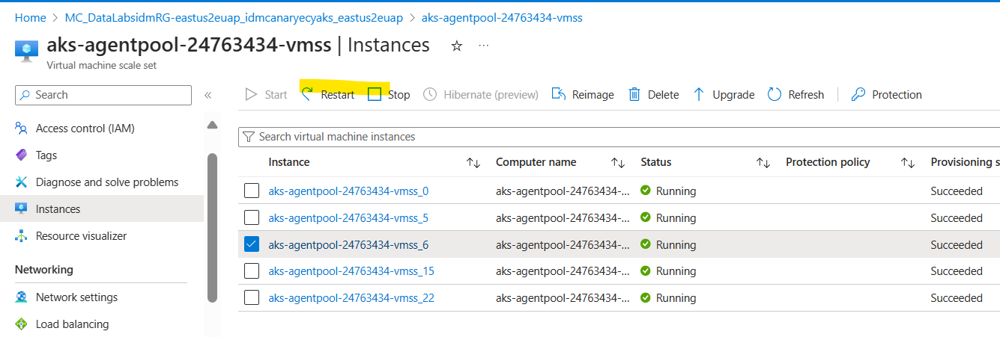

# Restarting Node

### Summary
Sometimes, AKS clusters will be stuck in a "Terminating" state for no reason during deployment. This is due to being a node being stuck, for one reason or the other (not service related).

### Sanity Check
This is only if 1 or 2 of the pods have a failure. If there are more than one of the pods in a failure state, this probably means it is an issue with the service itself, not the AKS cluster. You will probably see this during deployment, though you can also check with `kubectl get pods -A -o wide` to see if pods with a similar name are failing.

Please follow the [Accessing PROD AKS Clusters TSG](RunKubectlCommands.md) for more information on how to do this:

```
2024-03-27 00:56:48.238003: az aks command invoke --resource-group DataLabsidmRG-eastus2euap --name idmcanaryecyaks --command "kubectl get pods -n partner-namespace -o wide"
2024-03-27 00:57:07.962693: command started at 2024-03-27 00:57:02+00:00, finished at 2024-03-27 00:57:02+00:00 with exitcode=0
2024-03-27 00:57:07.963765: NAME                                  READY   STATUS        RESTARTS   AGE    IP             NODE                                NOMINATED NODE   READINESS GATES
2024-03-27 00:57:07.963882: idmapping-solution-5546754b5b-lg5zt   4/4     Terminating   0          5d3h   10.224.2.107   aks-agentpool-24763434-vmss000006   <none>           <none>
2024-03-27 00:57:07.966086: idmapping-solution-786645b4f7-gz5zz   4/4     Running       0          24h    10.224.0.5     aks-agentpool-24763434-vmss000005   <none>           <none>
2024-03-27 00:57:07.966539: idmapping-solution-786645b4f7-jvjcl   4/4     Running       0          24h    10.224.1.23    aks-agentpool-24763434-vmss000000   <none>           <none>
2024-03-27 00:57:07.967069: idmapping-solution-786645b4f7-m469k   4/4     Running       0          24h    10.224.2.175   aks-agentpool-24763434-vmss00000f   <none>           <none>
```

Once we find the pod that is being weird, "idmapping-solution-5546754b5b-lg5zt", run the following:

```
kubectl get pods -A -o wide --field-selector spec.nodeName=aks-agentpool-24763434-vmss000006 # change aks-agentpool-24763434-vmss000006 to the node that is failing
 
monitor-namespace    geneva-services-6cb67                                 6/6     Terminating   0              6d2h   10.224.2.38    aks-agentpool-24763434-vmss000006   <none>           <none>
monitor-namespace    telegraf-kubernetes-7trqw                             1/1     Terminating   0              6d2h   10.224.2.88    aks-agentpool-24763434-vmss000006   <none>           <none>
partner-namespace    idmapping-solution-5546754b5b-lg5zt                   4/4     Terminating   0              6d2h   10.224.2.107   aks-agentpool-24763434-vmss000006   <none>           <none>
solution-namespace   resource-proxy-79kps                                  1/1     Terminating   0              6d2h   10.224.2.140   aks-agentpool-24763434-vmss000006   <none>           <none>
tigera-operator      tigera-operator-64c87d9f5-lkv9x                       1/1     Running       18 (96m ago)   6d2h   10.224.2.38    aks-agentpool-24763434-vmss000006   <none>           <none>
...
```

If this is the case, please restart the node through portal. Here are the steps (can get outdated from UI changes from the azure portal though):
- AKS is managed through another ResourceGroup (created from the AKS team) with the following naming scheme, "MC_{AKS_ResourceGroup}\_{AKSName}\_{AKSRegion}". Please find that ResourceGroup in portal.
- Select the VMSS that needs a restart. There may be multiple VMSS since our CacheService is hosted on another VMSS. You can find this out by NODE from the `kubectl` command. For instance, "aks-agentpool-24763434-vmss000006" will be the "aks-agentpool-24763434" VMSS.
- Select the VM instance that has the failure. You can find the VM by NODE from the `kubectl` command. For instance, "aks-agentpool-24763434-vmss000006" will be "vmss000006" VM.
- Press RestartNode.


### Validation of the restart

1. Check if all VMs are still healthy.
2. Run `kubectl get pods -A` to see if all pods do not have "TERMINATED" State

If there are any further issues, please involve the Data Labs team.