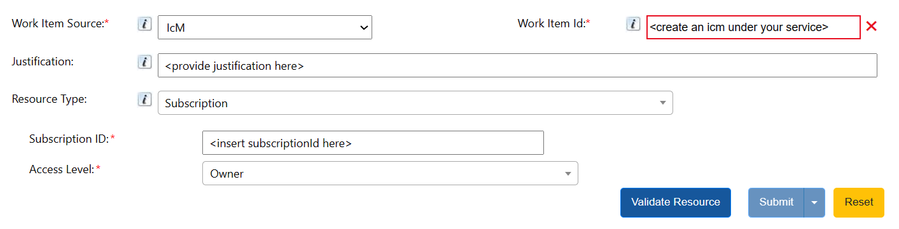
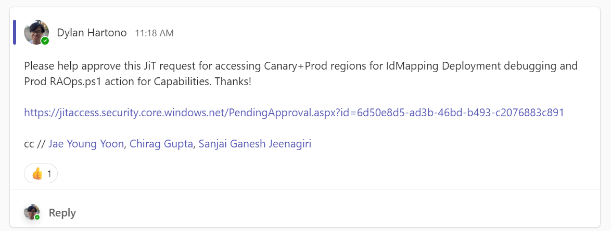
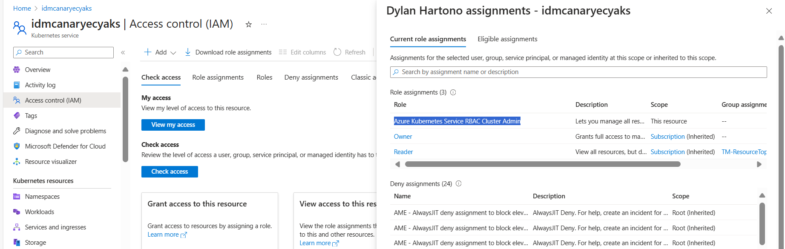
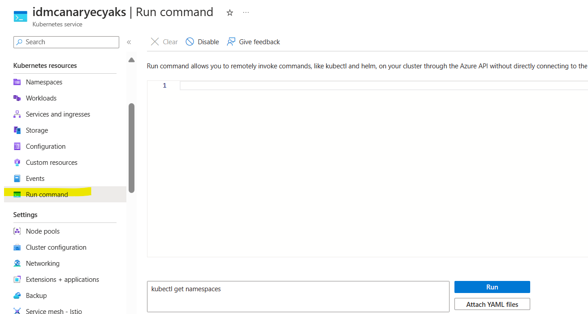
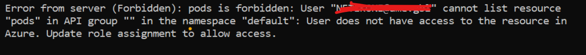

# Run Kubectl Commands

## Top Level Summary
For many of the investigations in Data Labs, Data Labs team members utilize `kubectl` commands on the cluster to get information about pods, services, logs of pods, etc. Since Data Labs is hosting their services on a private cluster, we restrict the api-server from being accessed outside of its own VNet, which is good for security of the service but also means we cannot easily access it on portal or powershell.

As of 3/27/2024, we do not have any other way to support interacting with resources within the cluster. There is feature work to support ACIS actions, but these are the rudimentary actions you need to take.

This TSG will help with being able to run `kubectl` commands through Azure Portal, which is a new feature created by AKS.

## Instructions
These instructions apply for INT and PROD. For steps labeled with "Only required for PROD:", please skip as you do not need elevated permissions for INT environment.

1. Only required for PROD: Find the AKS cluster on portal that you want to review and grab its subscriptionId.
2. Only required for PROD: Create a request in [JiT Portal Page](https://jitaccess.security.core.windows.net/WorkFlowTempAccess.aspx) for owner level access to the subscription.

3. Only required for PROD: Post your JiT request link in the [Planning-Approval channel](https://teams.microsoft.com/l/channel/19%3A51a43d8d168c431aa2549fcf09dc4c42%40thread.skype/Planning-Approval?groupId=f068473a-3eec-44af-90e3-11c124b4d791&tenantId=72f988bf-86f1-41af-91ab-2d7cd011db47) and tag members of AP-ResourceTopology group to approve (seniors, principals, and managers should be able to review).

4. Once request is granted, go to the portal page of your AKS cluster again and assign yourself the "Azure Kubernetes Service RBAC Cluster Admin" role assignment under Access Control (IAM). You may need to completely refresh your portal page for your subscription owner permissions to go through.

5. Please wait a few minutes and do a complete refresh of the screen (or just open the resource on another tab) to ensure your permissions are enabled, and then go to the "Run Command" tabe on the left side of the portal page, and try to run a command.

    - If you run into this issue, please try to completely refresh the screen or open a new tab of the resource. Probably permissions did not go through.
    

### Running on Powershell
Running on powershell does require additional installation of the Az.Aks module.
- Installation of Az.Aks: https://learn.microsoft.com/en-us/powershell/azure/install-azps-windows?view=azps-11.4.0&tabs=powershell&pivots=windows-psgallery (replace with Az.Aks module)
- Az.Aks: https://learn.microsoft.com/en-us/powershell/module/az.aks/?view=azps-11.4.0

Instructions are the same as above for JiT Request and adding "Azure Kubernetes Service RBAC Cluster Admin", but for powershell, run the following commands:
```
Connect-AzAccount

Select-AzSubscription -SubscriptionName ${subscriptionId}
```

Then, utilize `Invoke-AzAksRunCommand` to run commands:
```
Invoke-AzAksRunCommand -ResourceGroupName ${AKSCluster_ResourceGroup} -Name ${AKSCluster} -Force -Command "${kubectl command here}"
```