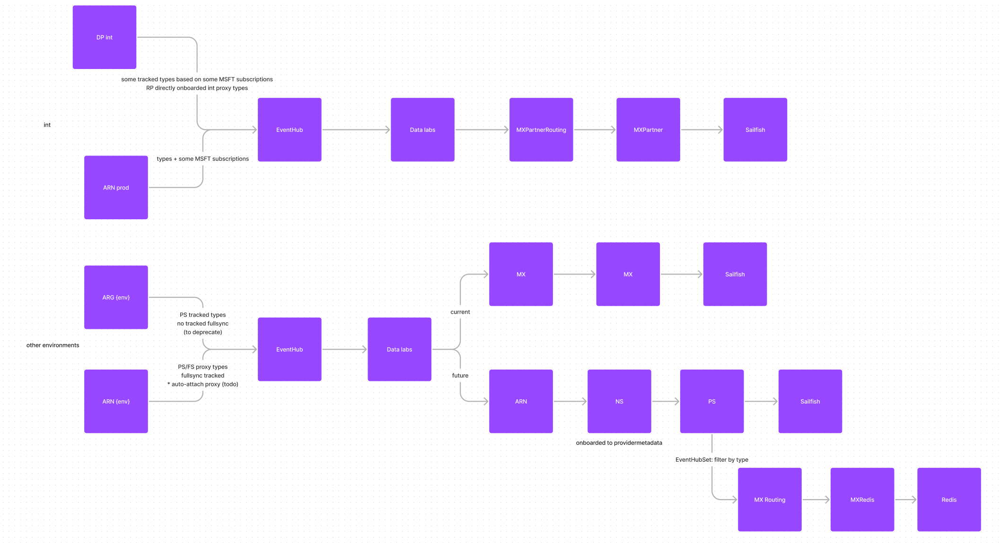

# Data Flow Issues/Missing Data TSG

## Data Flow Overview

The below diagram shows the data flows across different component in INT/PROD regions.

There are some peculiarities as INT (ARG Integration environment) is a limited PROD and not all components are fully supporting the same.

Explaining some of the acronyms used in the picture above below

1. DP => Data Platform (ARG Data processing Solution) [ICM Team: Azure Resource Graph\Data Platform Team]
1. ARN => Azure Resource Notification Service [ICM Team: Azure Resource Notifications\ARN Engineering]
1. ARG => Data Platform (ARG Data processing Solution) [ICM Team: Azure Resource Graph\Data Platform Team]
1. DL => Data Labs (Generic Platform to allow building solutions over it) [ICM Team: Azure Resource Graph\Data Labs]

## Missing Data Investigation

To investigate missing data you need exact resource ID and the time-range (preferably 5 min). This will help scoping the log search to right time and reduce the debugging time.

### Step-0 Confirm data flow is onboarded correctly
#### INT
Since in INT environment data is not fully flowing through ARN (though we can subscribe certain types/scopes, ARN INT work is planned). You need to onboard the data to ARG INT specifically. This requires following high level steps and all of them needs to be confirmed.

1. Add ARG INT application id access to the subscription (as monitoring reader). This is required for Reconciliation flow. (ARG INT Application Id =e6a18a18-ffe6-4ac3-b822-362bb577a6a3)
1. Send the change notifications to ARG INT endpoint. (INT: https://arg-int-nt.arg-int.core.windows.net/eventGrid/arnnotify)
1. DataLabs onboarding. Details [here](../onboarding/Data-Labs-Partner.md)

#### Production Environment, including Canary
Following steps are expected and needs to be confirmed before debugging any other steps.

1. Onboard to ARN as a publisher. Details [here](https://eng.ms/docs/cloud-ai-platform/azure-core/azure-management-and-platforms/control-plane-bburns/azure-resource-notifications/azure-resource-notifications-documentation/partners/publisher/onboarding)
1. Confirm onboarding the types required by your solution as subscriber. Details [here](https://eng.ms/docs/cloud-ai-platform/azure-core/azure-management-and-platforms/control-plane-bburns/azure-resource-notifications/azure-resource-notifications-documentation/partners/subscriber/onboarding)
1. DataLabs onboarding. Details [here](../onboarding/Data-Labs-Partner.md)

### Step-1 Confirm data is not showing up in the final store
#### INT
In environment is open and you can query the data directly by connecting to the backend cluster.
Sample Query:

ProxyResources 
| where timestamp > ago(7d) 
| where type startswith "microsoft.azurebusinesscontinuity" //This query is looking for general data types for this provider. 
| summarize count() by type, bin(timestamp, 6h) 
| order by timestamp asc 

INT Sailfish(Kusto) Cluster: https://armtopologylatest.kusto.windows.net/AzureResourcesTopology

#### PROD
You will need to use Geneva action to connect to the backend cluster and query the data and follow the steps given in [Resource Missing TSG](https://eng.ms/docs/cloud-ai-platform/azure-core/azure-management-and-platforms/control-plane-bburns/azure-resource-graph/azure-resource-graph/write-path/cris/data-consistency/CRI--Resource-missing.md)

### Step-2 Data is not reaching the store

#### Step-2.1 Check from Solution logs if data is reaching there, if not continue to next step

TODO Log links to be added @Dylan to help  
NOTE: The solution logs will be in different namespace. Since this is not closed this will be done after closure.  
If it is issue with the solution, raise an incident on the solution team

#### Step-2.2 Check from Data Labs IOService logs if data is reaching there, if not continue to next step

Sample Log [link] (https://portal.microsoftgeneva.com/logs/dgrep?be=DGrep&offset=-1&offsetUnit=Minutes&UTC=false&ep=Diagnostics%20PROD&ns=ARGDataLabs&en=ActivityCompleted,ActivityFailed&serverQuery=source%0A|%20where%20service%20%3D%3D%20"IOService"&serverQueryType=kql%20)

TODO Log links to be review/updated @Dylan to help 
If it is issue with the Data Labs, raise an incident on the Data Labs team

#### Step-2.3 Check from data labs log if the input EH is receiving any data

Get input EH details from the DataLabs logs (TODO @Dylan to help) 
Check if the input EH's are getting any data? This should be possible to look at from the dashboards, including filtering by type (TODO @Dylan to help). 
If the data is not reaching Data Labs, the issue with upstream data source ARN or DP, raise an incident on corresponding team.
