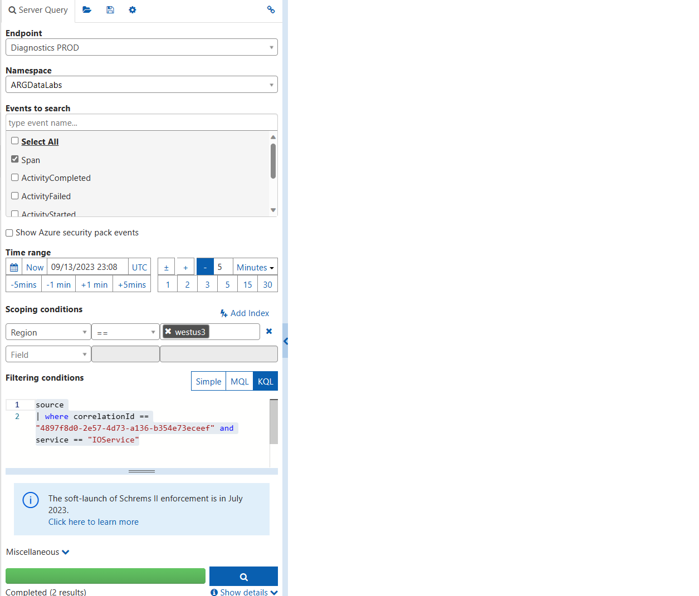
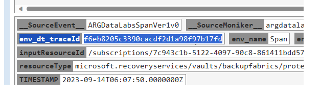
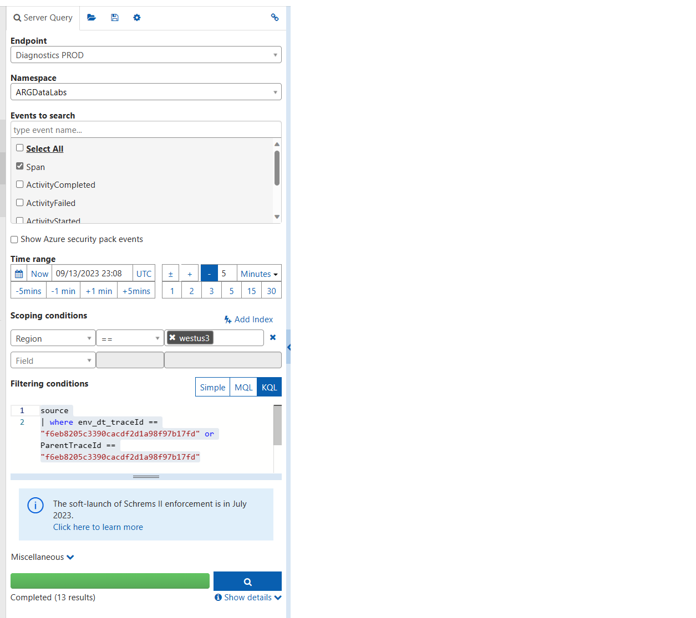
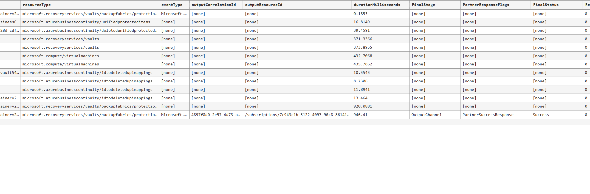
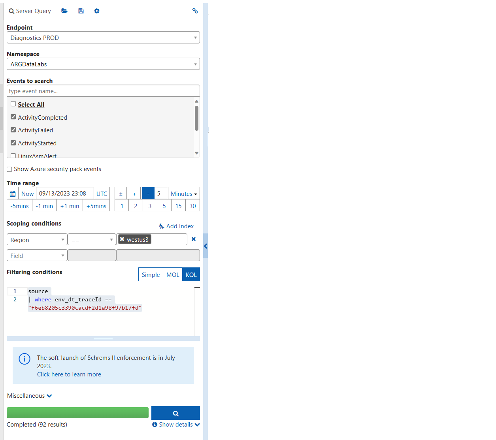
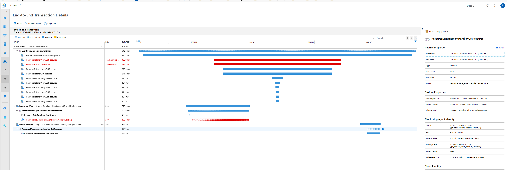

# How to trace individual Input/Output resource inside DataLabs

For DataLabs Log/Trace Internals, please refer to this page   

[DataLabs Log/Trace Internals](./DataLabsLogTraceInternals.md)

# DataLabs Logs/Trace Internals

## Example how to find logs and trace

For example, I would like to find logs with correlation Id (input correlation Id). 

1. Select Span table only  

Query with filter

e.g)  
source   
| where correlationId == "4897f8d0-2e57-4d73-a136-b354e73eceef" and service == "IOService"   

https://portal.microsoftgeneva.com/s/B93EA070

It is strongly recommend to start search with Span table first because number of logs in Span table is much less than other ActivityMonitor(ActivityStarted/Completed/Failed) tables.
Span table only shows OpenTelemetry Activity.

Once you get some result, always find trace Id first. Trace Id column name is "env_dt_traceId". 
Mostly we have one traceId for each correlation Id, but if we receive multiple notifications using same correlationId, we will see different "env_dt_traceId" because we assing new TraceId per each notification

2. Query with TraceId. Below query will find all openTelemetry activity (including child activity(if there are streaming responses for one input)

e.g.)   
source   
| where env_dt_traceId == "f6eb8205c3390cacdf2d1a98f97b17fd" or ParentTraceId == "f6eb8205c3390cacdf2d1a98f97b17fd"     

   

https://portal.microsoftgeneva.com/s/ECDADA13   

If you do sort by PreciseTimeStamp asc, you can see the last activity and see all summary. outputResourceId, duration, FinalStage, PartnerResponseFalgs, FInalStatus

3. If you want to see more details logs in ActivityMonitor table belonging to the same traceId, now you can query with same traceId filter.
ActivityMonitor table doesn't have ParentTraceId column, so you have to use env_dt_traceId only. 

e.g.)   
source    
| where env_dt_traceId == "f6eb8205c3390cacdf2d1a98f97b17fd"   

   

https://portal.microsoftgeneva.com/s/D0BD223A   

Now, you can see all details of each ActivityMonitor belonging to the TraceId. 

**Now ActivityStarted/Completed/Failed and Span table has startTime column. So you can sort rows based on startTime. It will show actual sequence of Activitiy creation. TimeStamp column is based on finished Time.**

4. Geneva also supports some UI showing OpenTelemetry Activity across stacks (not only DataLabs but also other Azure Stack)
You can click the env_dt_traceId column. Then it will pop up new windows showing below UI

https://portal.microsoftgeneva.com/trace/details/f6eb8205c3390cacdf2d1a98f97b17fd?fromDate=2023-09-14T02%3A07%3A50.532Z&toDate=2023-09-14T10%3A07%3A50.532Z&regions=East%20US   

   

## Other Search using input, output resource Id

Similar to above example using correlation Id, You can also search with inputResourceId, outputResourceId, outputCorrelationId instead of correlationId column to find trace Id (env_dt_traceId). 
Once you find traceId, same step will be applied.

TODO: More example to track more advance scenario(using parentTraceId column)
(one input -> streaming responses case
 batch input -> streaming response case)
